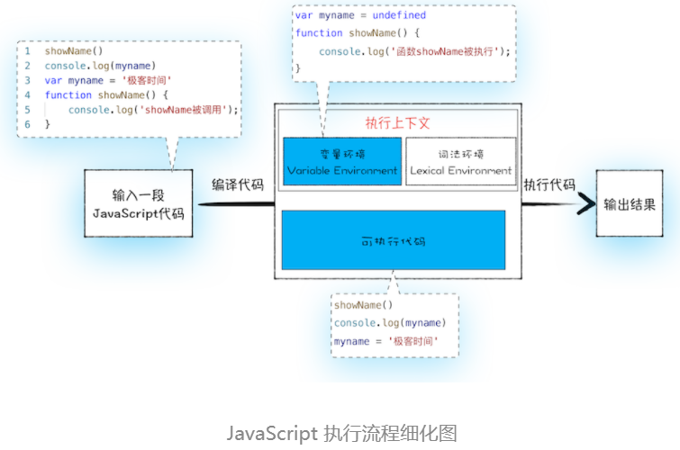
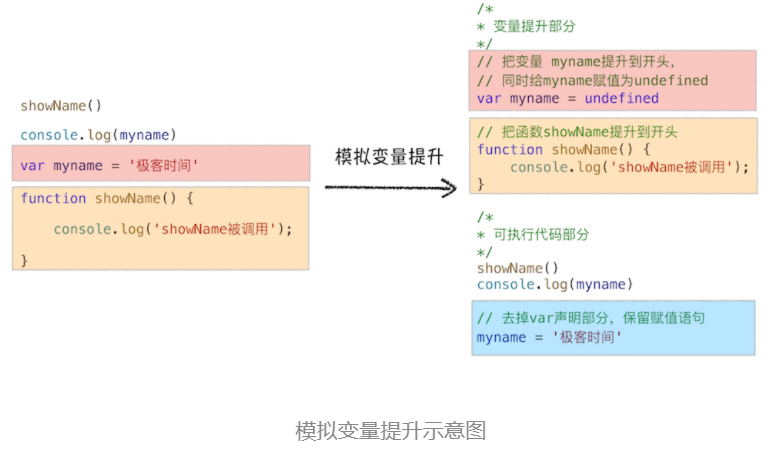

## 变量提升

JavaScript代码在被浏览器经过编译后会生成两部分内容：**执行上下文**和**可执行代码**。

**所谓的变量提升，是指在 JavaScript 代码执行过程中，JavaScript 引擎把变量的声明部分和函数的声明部分提升到代码开头的“行为”。变量被提升后，会给变量设置默认值，这个默认值就是我们熟悉的 undefined。**

需要注意的是：如上图中的代码打印出来是“showName函数被调用” 和undefined。变量提升只是把变量的定义提升了并赋值为undefined，赋值是被放到了可执行代码中的，所以打印出来是undefined。

