## 栈空间和堆空间

#### 1、JavaScript的语言类型

**静态语言**：我们把这种在使用之前就需要确认其变量数据类型的称为静态语言。

**动态语言**：我们把在运行过程中需要检查数据类型的语言称为动态语言。

由于Javascript在声明变量之前不需要确认其数据类型，故JavaScript是动态语言。

​	在C语言中，可以把int型的变量赋值给bool型的变量c，因为在赋值过程中C编译器把int型悄悄转换为了bool型变量，像这种偷偷转换成为**隐式类型转换**，支持隐式类型转换的语言称为**弱类型语言**，不支持隐式类型转换的语言称为**强类型语言**。

其各种语言的语言类型图如下所示：

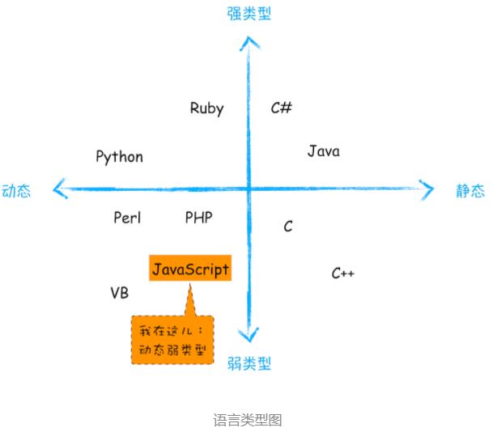

**JavaScript 是一种弱类型的、动态的语言**。

- **弱类型**，意味着你不需要告诉 JavaScript 引擎这个或那个变量是什么数据类型，JavaScript 引擎在运行代码的时候自己会计算出来。
- **动态**，意味着你可以使用同一个变量保存不同类型的数据。

JavaScript的变量类型有8种，如下图所示：

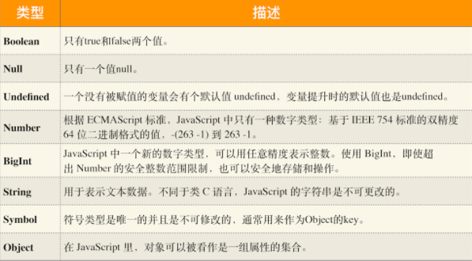

我们把前7种数据类型成为**原始类型（或基本类型）**，最后一种Object称为**引用类型**。

#### 2、内存空间

在JavaScript的执行过程中，主要有三种类型的内存空间，分别是**代码空间**、**栈空间**和**堆空间**。

**（1）代码空间**

​		代码空间主要存储的是可执行代码。

**（2）栈空间和堆空间**

​		栈空间就是我们之前反复提及的调用栈，是用来存储执行上下文的。如执行下面一段代码，其调用栈状态图如下所示：

```javascript
function foo(){
    var a = " 极客时间 "
    var b = a
    var c = {name:" 极客时间 "}
    var d = c
}
foo()
```

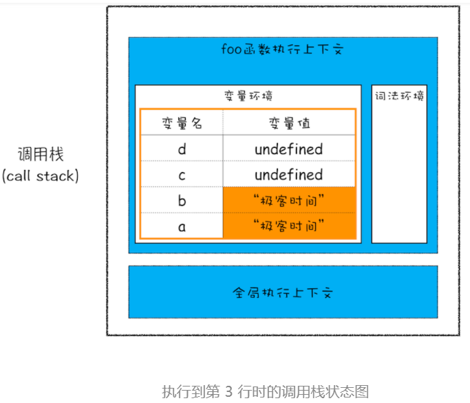


​		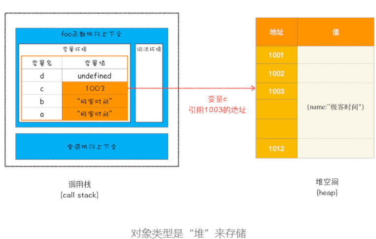

**原始类型的赋值会完整复制变量值，而引用类型的赋值是复制引用地址**。

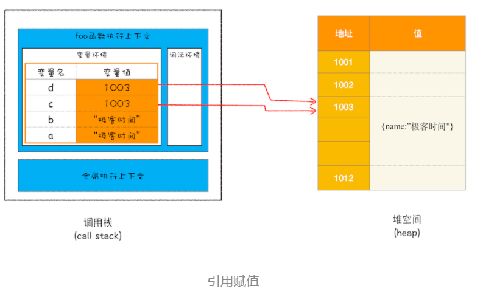

<font color='red'>**原始类型的数据值都是直接保存在“栈”中的，引用类型的值是存放在“堆”中的。**</font>

#### 3、为什么JavaScript要分别维护栈和堆空间

​		因为 JavaScript 引擎需要用栈来维护程序执行期间上下文的状态，如果栈空间大了话，所有的数据都存放在栈空间里面，那么会影响到上下文切换的效率，进而又影响到整个程序的执行效率。比如文中的 foo 函数执行结束了，JavaScript 引擎需要离开当前的执行上下文，只需要将指针下移到上个执行上下文的地址就可以了，foo 函数执行上下文栈区空间全部回收，具体过程你可以参考下图：

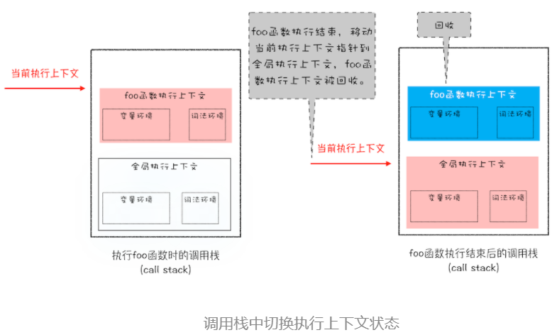

​	**通常情况下，栈空间都不会设置太大，主要用来存放一些原始类型的小数据**。而引用类型的数据占用的空间都比较大，所以这一类数据会被存放到堆中，**堆空间很大，能存放很多大的数据**，不过缺点是分配内存和回收内存都会占用一定的时间。

#### 4、再谈闭包

```javascript
function foo() {
    var myName = " 极客时间 "
    let test1 = 1
    const test2 = 2
    var innerBar = { 
        setName:function(newName){
            myName = newName
        },
        getName:function(){
            console.log(test1)
            return myName
        }
    }
    return innerBar
}
var bar = foo()
bar.setName(" 极客邦 ")
bar.getName()
console.log(bar.getName())
```

1. 当 JavaScript 引擎执行到 foo 函数时，首先会编译，并创建一个空执行上下文。
2. 在编译过程中，遇到内部函数 setName，JavaScript 引擎还要对内部函数做一次快速的词法扫描，发现该内部函数引用了 foo 函数中的 myName 变量，由于是内部函数引用了外部函数的变量，所以 JavaScript 引擎判断这是一个闭包，**于是在堆空间创建换一个“closure(foo)”的对象（这是一个内部对象，JavaScript 是无法访问的），用来保存 myName 变量。**
3. 接着继续扫描到 getName 方法时，发现该函数内部还引用变量 test1，于是 JavaScript 引擎又将 test1 添加到“closure(foo)”对象中。这时候堆中的“closure(foo)”对象中就包含了 myName 和 test1 两个变量了。
4. 由于 test2 并没有被内部函数引用，所以 test2 依然保存在调用栈中。

通过上面的分析，我们可以画出执行到 foo 函数中“return innerBar”语句时的调用栈状态，如下图所示：

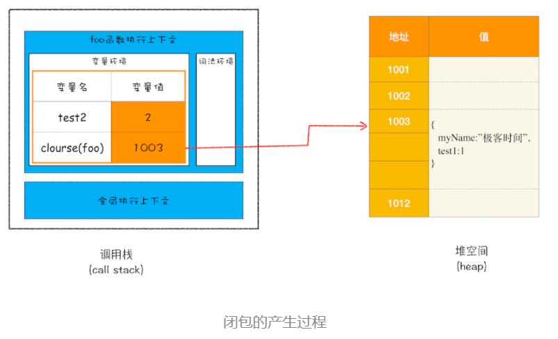

​	当执行到 foo 函数时，闭包就产生了；当 foo 函数执行结束之后，返回的 getName 和 setName 方法都引用“clourse(foo)”对象，所以即使 foo 函数退出了，“clourse(foo)”依然被其内部的 getName 和 setName 方法引用。所以在下次调用`bar.setName`或者`bar.getName`时，创建的执行上下文中就包含了“clourse(foo)”。

​	总的来说，产生闭包的核心有两步：第一步是需要预扫描内部函数；第二步是把内部函数引用的外部变量保存到堆中。

## 浏览器的垃圾回收机制

 JavaScript、Java、Python 等语言，**产生的垃圾数据是由垃圾回收器来释放的**，并不需要手动通过代码来释放。

#### 1、调用栈中的数据如何回收

```javascript
function foo(){
    var a = 1
    var b = {name:" 极客邦 "}
    function showName(){
      var c = " 极客时间 "
      var d = {name:" 极客时间 "}
    }
    showName()
}
foo()
```

​	执行到 showName 函数时，那么 JavaScript 引擎会创建 showName 函数的执行上下文，并将 showName 函数的执行上下文压入到调用栈中，最终执行到 showName 函数时，其调用栈就如下图所示。与此同时，还有一个**记录当前执行状态的指针（称为 ESP）**，指向调用栈中 showName 函数的执行上下文，表示当前正在执行 showName 函数。

​	接着，当 showName 函数执行完成之后，函数执行流程就进入了 foo 函数，那这时就需要销毁 showName 函数的执行上下文了。ESP 这时候就帮上忙了，JavaScript 会将 ESP 下移到 foo 函数的执行上下文，**这个下移操作就是销毁 showName 函数执行上下文的过程**。

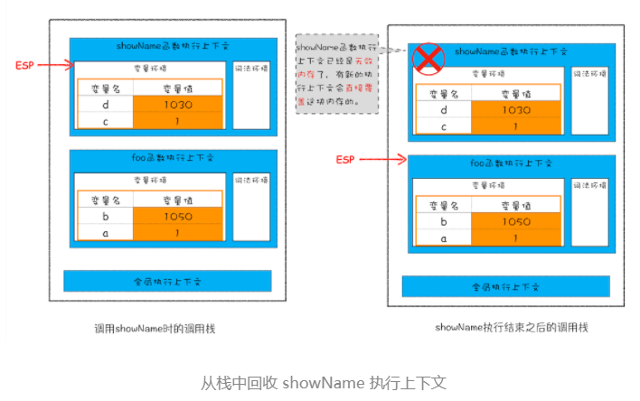

所以说，当一个函数执行结束之后，**JavaScript 引擎会通过向下移动 ESP 来销毁该函数保存在栈中的执行上下文**。

#### 2、堆中的数据是如何回收的

**代际假说（The Generational Hypothesis）**：

- 第一个是大部分对象在内存中存在的时间很短，简单来说，就是很多对象一经分配内存，很快就变得不可访问；
- 第二个是不死的对象，会活得更久。

**分代收集**：

​	在 V8 中会把堆分为**新生代**和**老生代**两个区域，**新生代中存放的是生存时间短的对象，老生代中存放的生存时间久的对象**。新生区通常只支持 1～8M 的容量，而老生区支持的容量就大很多了。对于这两块区域，V8 分别使用两个不同的垃圾回收器，以便更高效地实施垃圾回收。

- **副垃圾回收器，主要负责新生代的垃圾回收。**
- **主垃圾回收器，主要负责老生代的垃圾回收。**

**垃圾回收器的工作流程**：

​	不管是主垃圾回收器还是副垃圾回收器都遵循以下这套公共的执行流程：

​	1、**标记空间中活动对象和非活动对象**。所谓活动对象就是还在使用的对象，非活动对象就是可以进行垃圾回收的对象。

​	2、**回收非活动对象所占据的内存**。其实就是在所有的标记完成之后，统一清理内存中所有被标记为可回收的对象。

​	3、**内存整理**。频繁回收对象后，内存中就会存在大量不连续空间，我们把这些不连续的内存空间称为**内存碎片**。当出现量不连续的内存碎片后，我们再想分配一个较大的连续空间就会出现内存不足的情况。

#### 3、副垃圾回收器

​	副垃圾回收器主要负责新生区的垃圾回收，用**Scavenge 算法**来处理。其原理就是：把新生代空间对半划分为两个区域，一半是对象区域，一半是空闲区域，新加入的对象都会存放到对象区域，**当对象区域快被写满时**，就需要执行一次垃圾清理操作。

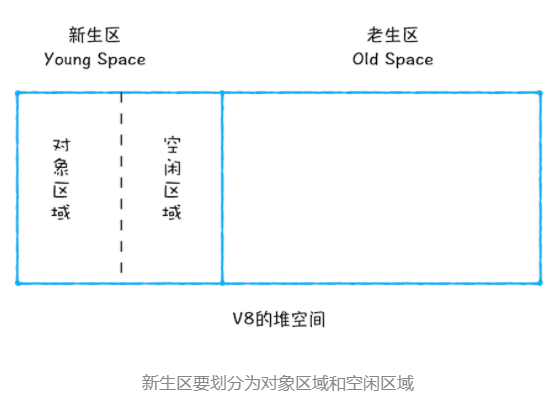

其回收过程如下：

​	1、对对象区域中的垃圾做标记，活动对象和非活动会对象；

​	2、标记完成之后，就进入垃圾清理阶段，副垃圾回收器会把这些**仍然存活的对象**复制到空闲区域中，**同时它还会把这些对象有序地排列起来，所以这个复制过程**，也就相当于完成了内存整理操作，复制后空闲区域就没有内存碎片了。

​	3、完成复制后，对象区域与空闲区域进行角色翻转，也就是原来的对象区域变成空闲区域，原来的空闲区域变成了对象区域。

**对象晋升策略**：由于为了执行效率，新生区的空间通常会被设置的比较小，所以很容易被存满，为此JavaScript引擎引入了晋升策略，即：**经过两次垃圾回收依然还存活的对象，会被移动到老生区中。**

#### 4、主垃圾回收器

​	老生区中的对象有两个特点，一个是对象占用空间大，另一个是对象存活时间长。

​	主垃圾回收器是采用**标记 - 清除（Mark-Sweep）**的算法进行垃圾回收的。

1、**对垃圾数据做标记**。当调用栈中的ESP指向下一个执行上下文后，上一个执行上下文中引用对象在堆中的数据就会被当做垃圾数据被**标为红色**，而当前正被ESP指向的指向上下文中指针指向的栈中数据会被标为**活动数据**。

2、**垃圾数据的清除**。使用**Mark-Sweep**算法清除掉被标记为红色的垃圾数据。

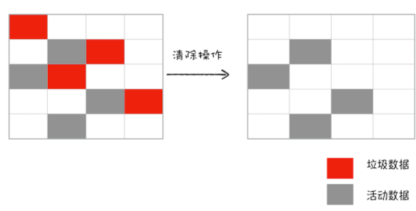

3、**内存整理**。使用**标记 - 整理（Mark-Compact）**对内存碎片进行整理。

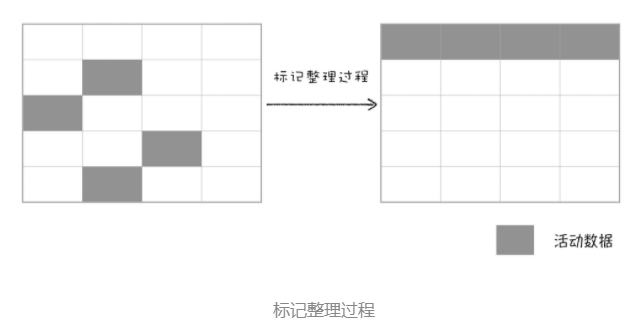

#### 5、全停顿

​	于 JavaScript 是运行在主线程之上的，一旦执行垃圾回收算法，都需要将正在执行的 JavaScript 脚本暂停下来，待垃圾回收完毕后再恢复脚本执行。我们把这种行为叫做**全停顿（Stop-The-World）**。

​	为了降低老生代的垃圾回收而造成的卡顿，V8 将标记过程分为一个个的子标记过程，同时让垃圾回收标记和 JavaScript 应用逻辑交替进行，直到标记阶段完成，我们把这个算法称为**增量标记（Incremental Marking）算法**。如下图所示：

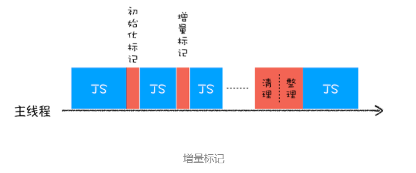

​	使用增量标记算法，可以把一个完整的垃圾回收任务拆分为很多小的任务，这些小的任务执行时间比较短，可以穿插在其他的 JavaScript 任务中间执行，这样当执行上述动画效果时，就不会让用户因为垃圾回收任务而感受到页面的卡顿了。

## 编译器和解释器

#### 1、编译器和解释器

​	**编译型语言在程序执行之前，需要经过编译器的编译过程，并且编译之后会直接保留机器能读懂的二进制文件，这样每次运行程序时，都可以直接运行该二进制文件，而不需要再次重新编译了**。比如 C/C++、GO 等都是编译型语言。

​	**解释型语言编写的程序，在每次运行时都需要通过解释器对程序进行动态解释和执行**。比如 Python、JavaScript 等都属于解释型语言。

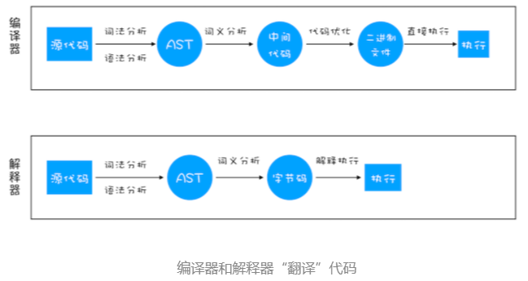

**（1）编译型语言的执行流程：**编译器首先会依次对源代码进行词法分析、语法分析，生成抽象语法树（AST），然后是优化代码，最后再生成处理器能够理解的机器码。如果编译成功，将会生成一个可执行的文件。但如果编译过程发生了语法或者其他的错误，那么编译器就会抛出异常，最后的二进制文件也不会生成成功。

**（2）解释型语言的执行流程：**解释器也会对源代码进行词法分析、语法分析，并生成抽象语法树（AST），不过它会再基于抽象语法树生成字节码，最后再根据字节码来执行程序、输出结果。

#### 2、V8 是如何执行一段 JavaScript 代码的

​	V8 在执行过程中既有**解释器 Ignition**，又有**编译器 TurboFan**。其全局执行流程如下所示：

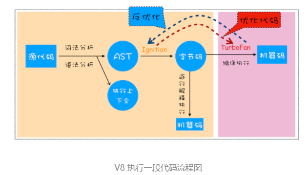

##### （1）生成抽象语法树（AST）和执行上下文

​	首先，将源代码转换成**抽象语法树（AST）**和**执行上下文**。高级语言是开发者可以理解的语言，而对于编译器和解释器来说他们可以理解的就是抽象语法树（AST）。这和渲染引擎将HTML格式的文件转换为自己可以理解的DOM树类似。

​	AST 是非常重要的一种数据结构，在很多项目中有着广泛的应用。其中最著名的一个项目是 Babel。Babel 是一个被广泛使用的代码转码器，可以将 ES6 代码转为 ES5 代码，这意味着你可以现在就用 ES6 编写程序，而不用担心现有环境是否支持 ES6。**Babel 的工作原理就是先将 ES6 源码转换为 AST，然后再将 ES6 语法的 AST 转换为 ES5 语法的 AST，最后利用 ES5 的 AST 生成 JavaScript 源代码。**

​	除了 Babel 外，还有 ESLint 也使用 AST。ESLint 是一个用来检查 JavaScript 编写规范的插件，其检测流程也是需要将源码转换为 AST，然后再利用 AST 来检查代码规范化的问题。

**生成AST的两个阶段：**

**第一阶段是分词（tokenize），又称为词法分析**，其作用是将一行行的源码拆解成一个个 token。所谓**token**，指的是语法上不可能再分的、最小的单个字符或字符串。

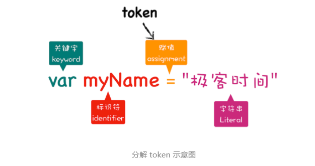

​	从图中可以看出，通过`var myName = “极客时间”`简单地定义了一个变量，其中关键字“var”、标识符“myName” 、赋值运算符“=”、字符串“极客时间”四个都是 token，而且它们代表的属性还不一样。

**第二阶段是解析（parse），又称为语法分析**，其作用是将上一步生成的 token 数据，根据语法规则转为 AST。如果源码符合语法规则，这一步就会顺利完成。但如果源码存在语法错误，这一步就会终止，并抛出一个“语法错误”。

**有了 AST 后，那接下来 V8 就会生成该段代码的执行上下文。**


##### （2）生成字节码

​	有了 AST 和执行上下文后，那接下来的第二步，解释器 Ignition 就登场了，它会根据 AST 生成字节码，并解释执行字节码。

**字节码就是介于 AST 和机器码之间的一种代码。但是与特定类型的机器码无关，字节码需要通过解释器将其转换为机器码后才能执行。**

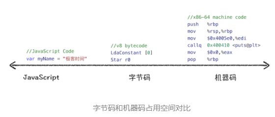

​	从图中可以看出，机器码所占用的空间远远超过了字节码，所以使用字节码可以减少系统的内存使用。

##### （3）执行代码

​	通常，如果有一段第一次执行的字节码，解释器 Ignition 会逐条解释执行。在执行字节码的过程中，如果发现有热点代码(HotSpot)，比如一段代码被重复执行多次，这种就称为**热点代码**，那么后台的编译器(TurboFan) 就会把该段热点的字节码编译为高效的机器码，然后当再次执行这段被优化的代码时，只需要执行编译后的机器码就可以了，这样就大大提升了代码的执行效率。

​	其实字节码配合解释器和编译器是最近一段时间很火的技术，比如 Java 和 Python 的虚拟机也都是基于这种技术实现的，我们把这种技术称为**即时编译（JIT）**。

#### 3、JavaScript的性能优化

主要关注以下三点：

1. 提升单次脚本的执行速度，避免 JavaScript 的长任务霸占主线程，这样可以使得页面快速响应交互；
2. 避免大的内联脚本，因为在解析 HTML 的过程中，解析和编译也会占用主线程；
3. 减少 JavaScript 文件的容量，因为更小的文件会提升下载速度，并且占用更低的内存。

#### 4、总结：

​	（1）解释器和编译器在执行代码时都会先将代码通过词法分析、语法分析生成抽象语法树（AST），不同的是解释型语言会通过解释器将AST转换为字节码并直接逐条执行；而编译器会在AST的基础上先优化代码然后生成机器码进而编译生成二进制文件，执行时直接执行这个二进制文件。

​	（2）JavaScript的编译流程是：先通过词法分析和语法分析生成AST和可执行上下文，然后通过解释器将AST转换为字节码，并逐条执行。在生成AST时主要分为两步：第一步先通过词法分析生成token，第二步通过语法分析将token转换为AST。

​	（3）V8在代码的编译过程中采用的JIT（即时编译）技术来实现的。就是在生成字节码后，先使用解释器逐条解释并执行代码，如果遇到热点代码（被多次重复执行的代码），就会把这段字节码通过编译器编译为机器码，当再次遇到改代码是就可以直接执行。