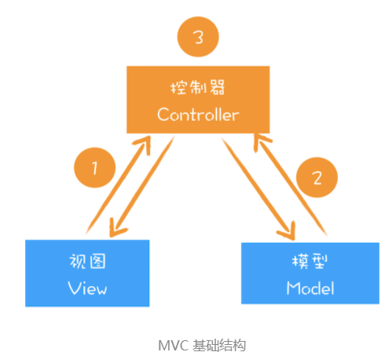

## 一、Chrome开发者工具

​		Chrome 开发者工具（简称 DevTools）是一组网页制作和调试的工具，内嵌于 Google Chrome 浏览器中。共包含10个功能面板：Elements、Console、Sources、NetWork、Performance、Memory、Application、Security、Audits 和 Layers。其大致功能如下：


#### 网络面板

##### 1、控制器

​	控制器有 4 个比较重要的功能，如下：

.png)

- 红色圆点的按钮，表示“开始 / 暂停抓包”，这个功能很常见，很容易理解。
- “全局搜索”按钮，这个功能就非常重要了，可以在所有下载资源中搜索相关内容，还可以快速定位到某几个你想要的文件上。
- Disable cache，即“禁止从 Cache 中加载资源”的功能，它在调试 Web 应用的时候非常有用，因为开启了 Cache 会影响到网络性能测试的结果。
- Online 按钮，是“模拟 2G/3G”功能，它可以限制带宽，模拟弱网情况下页面的展现情况，然后你就可以根据实际展示情况来动态调整策略，以便让 Web 应用更加适用于这些弱网。

##### 2、过滤器

​	网络面板中的过滤器，主要就是起过滤功能。因为有时候一个页面有太多内容在详细列表区域中展示了，而你可能只想查看 JavaScript 文件或者 CSS 文件，这时候就可以通过过滤器模块来筛选你想要的文件类型。

##### 3. 抓图信息

​	抓图信息区域，可以用来分析用户等待页面加载时间内所看到的内容，分析用户实际的体验情况。比如，如果页面加载 1 秒多之后屏幕截图还是白屏状态，这时候就需要分析是网络还是代码的问题了。（勾选面板上的“Capture screenshots”即可启用屏幕截图。）

##### 4. 时间线

​	时间线，主要用来展示 HTTP、HTTPS、WebSocket 加载的状态和时间的一个关系，用于直观感受页面的加载过程。如果是多条竖线堆叠在一起，那说明这些资源被同时被加载。至于具体到每个文件的加载信息，还需要用到下面要讲的详细列表。

##### 5. 详细列表 

​	详细记录了每个资源从发起请求到完成请求这中间所有过程的状态，以及最终请求完成的数据信息。通过该列表，你就能很容易地去诊断一些网络问题。	

##### 6、下载信息摘要

​	下载信息概要中，要重点关注下 DOMContentLoaded 和 Load 两个事件，以及这两个事件的完成时间。

- DOMContentLoaded，这个事件发生后，说明页面已经构建好 DOM 了，这意味着构建 DOM 所需要的 HTML 文件、JavaScript 文件、CSS 文件都已经下载完成了。
- Load，说明浏览器已经加载了所有的资源（图像、样式表等）。

#### 网络面板中的详细列表

##### 1. 列表的属性

##### 2. 详细信息 	

​	可以在此查看请求列表中任意一项的请求行和请求头信息，还可以查看响应行、响应头和响应体。然后你可以根据这些查看的信息来判断你的业务逻辑是否正确，或者有时候也可以用来逆向推导别人网站的业务逻辑。.png)

##### 3. 单个资源的时间线

​	时间线面板中可查看HTTP请求的基础流程，如下图：

.png)

 **Queuing**：表示排队等待的时间。浏览器发起一个请求的时候，会有很多原因导致该请求不能被立即执行，而是需要排队等待。导致排队等待的原因有如下：

- 页面中的资源是有优先级的，通常优先级低的资源会给优先级高的资源让路进入排队等待状态。比如 CSS、HTML、JavaScript 等都是页面中的核心文件，所以优先级最高；而图片、视频、音频这类资源就不是核心资源，优先级就比较低。
- 浏览器会为每个域名最多维护 6 个 TCP 连接，如果发起一个 HTTP 请求时，这 6 个 TCP 连接都处于忙碌状态，那么这个请求就会处于排队状态。
- 网络进程在为数据分配磁盘空间时，新的 HTTP 请求也需要短暂地等待磁盘分配结束。

**Stalled**：表示停滞的意思，即在发起连接前，由于一些原因可能导致连接过程被推迟。

**Initial connection/SSL**：和服务器建立连接的阶段，包括了建立TCP连接说花费的时间。如果你使用了 HTTPS 协议，那么还需要一个额外的 SSL 握手时间，这个过程主要是用来协商一些加密信息的。

**Request sent**：表示网络进程准备好数据，并将其发送给网络的时间。

**Waiting** (TTFB)：第一字节时间，TTFB 是反映服务端响应速度的重要指标，对服务器来说，TTFB 时间越短，就说明服务器响应越快。

**Content Download**：从第一字节时间到接收到全部响应数据所用的时间。

#### 优化时间线上的耗时项

##### 1、排队（Queuing）时间过久

​	排队时间过久，大概率是由浏览器为每个域名最多维护 6 个连接导致的。

- 使用**域名分片**技术：可以让 1 个站点下面的资源放在多个域名下面，比如放到 3 个域名下面，这样就可以同时支持 18 个连接。
- 将站点升级到HTTP2：因为 HTTP2 已经没有每个域名最多维护 6 个 TCP 连接的限制了。

##### 2. 第一字节时间（TTFB）时间过久

- 服务器生成页面数据的时间过久：
- 网络的原因：
- 发送请求头时带上了多余的用户信息：一些不必要的 Cookie 信息，服务器接收到这些 Cookie 信息之后可能需要对每一项都做处理，这样就加大了服务器的处理时长。

​     面对第一种服务器的问题，你可以想办法去提高服务器的处理速度，比如通过增加各种缓存的技术；针对第二种网络问题，你可以使用 CDN 来缓存一些静态文件；至于第三种，你在发送请求时就去尽可能地减少一些不必要的 Cookie 数据信息。

## 二、DOM树

问题：HTML解析器是等整个HTML文档加载完成之后开始解析的，还是随着HTML文档边加载边解析？

答：HTML 解析器并不是等整个文档加载完成之后再解析的，而是网络进程加载了多少数据，HTML 解析器便解析多少数据。

具体流程如下：

> 网络进程接收到响应头之后，会根据响应头中的 content-type字段来判断文件的类型，比如 content-type 的值是“text/html”，那么浏览器就会判断这是一个 HTML 类型的文件，然后为该请求选择或者创建一个渲染进程。渲染进程准备好之后，网络进程和渲染进程之间会建立一个共享数据的管道，网络进程接收到数据后就往这个管道里面放，而渲染进程则从管道的另外一端不断地读取数据，并同时将读取的数据“喂”给 HTML 解析器。你可以把这个管道想象成一个“水管”，网络进程接收到的字节流像水一样倒进这个“水管”，而“水管”的另外一端是渲染进程的 HTML 解析器，它会动态接收字节流，并将其解析为 DOM。

#### 1、DOM的详细生成过程

字节流转化为DOM分为三个阶段：


第一阶段：通过分词器将字节流转换为Token


第二、三阶段是同步进行的，需要将Token解析为DOM节点，并将DOM节点添加到DOM树中。

> 在HTML维护的Token栈结构中：
>
> ​	如果压入到栈中的是**StartTag Token**，HTML 解析器会为该 Token 创建一个 DOM 节点，然后将该节点加入到 DOM 树中，它的父节点就是栈中相邻的那个元素生成的节点。
>
> ​	如果分词器解析出来是**文本 Token**，那么会生成一个文本节点，然后将该节点加入到DOM 树中，文本 Token 是不需要压入到栈中，它的父节点就是当前栈顶 Token 所对应的 DOM 节点。
>
> ​	如果分词器解析出来的是**EndTag 标签**，比如是 EndTag div，HTML 解析器会查看Token 栈顶的元素是否是 StarTag div，如果是，就将 StartTag div 从栈中弹出，表示该 div 元素解析完成。
>
> 通过分词器产生的新 Token 就这样不停地压栈和出栈，整个解析过程就这样一直持续下去，直到分词器将所有字节流分词完成。

如其创建下面一段代码：

```javascript
<html>
	<body>
		<div>1</div>
		<div>test</div>
	</body>
</html>
```


#### 2、JavaScript如何影响DOM生成

##### （1）内嵌式JavaScript脚本

```javascript
<html>
	<body>
		<div>1</div>
		<script>
			let div1 = document.getElementsByTagName('div')[0]
			div1.innerText = 'time.geekbang'
		</script>
		<div>test</div>
	</body>
</html>
```

​	DOM的解析流程还是和之前介绍的一样，但是解析到<script>标签时，渲染引擎判断这是一段脚本，此时 HTML 解析器就会暂停 DOM 的解析，因为接下来的 JavaScript 可能要修改当前已经生成的 DOM 结构。脚本执行完成之后，HTML 解析器恢复解析过程，继续解析后续的内容，直至生成最终的 DOM。

##### （2）引入式的JavaScript文件

```javascript
//foo.js
let div1 = document.getElementsByTagName('div')[0]
div1.innerText = 'time.geekbang'

<html>
	<body>
		<div>1</div>
		<script type="text/javascript" src='foo.js'></script>
		<div>test</div>
	</body>
</html>
// 执行到 JavaScript 标签时，暂停整个 DOM 的解析，执行 JavaScript 代码，不过这里执行 JavaScript 时，需要先下载这段 JavaScript 代码因为JavaScript 文件的下载过程会阻塞DOM 解析，而通常下载又是非常耗时的，会受到网络环境、JavaScript 文件大小等因素的影响。
```


浏览器对下载JavaScript时DOM阻塞做出的优化：**预解析操作**

> ​		当渲染引擎收到字节流之后，会开启一个<font color=red>预解析线程</font>，用来分析 HTML 文件中包含的 JavaScript、CSS 等相关文件，解析到相关文件之后，预解析线程会提前下载这些文件。

为了避免JavaScript阻塞DOM解析，还可以使用以下相关策略：

（1）使用CDN来加速JavaScript文件加载

（2）压缩JavaScript文件的体积

（3）如果JavaScript文件中没有操作DOM相关的代码，就可以将该JavaScript脚本设置为异步加载，通过async或者defer来标记代码。

```javascript
<script async type="text/javascript" src='foo.js'></script>

<script defer type="text/javascript" src='foo.js'></script>

//async 和 defer 虽然都是异步的，不过还有一些差异，使用 async 标志的脚本文件一旦加载完成，会立即执行；而使用了 defer 标记的脚本文件，需要在 DOMContentLoaded 事件之前执行。
```

##### （3）JavaScript代码中有用来操作CSSOM的代码

如下面代码所示：

```javascript
 //theme.css
div {color:blue}

<html>
	<head>
	<style src='theme.css'> </style>
	</head>
	<body>
		<div>1</div>
		<script>
			let div1 = document.getElementsByTagName('div')[0]
			div1.innerText = 'time.geekbang' // 需要 DOM
			div1.style.color = 'red' // 需要 CSSOM
		</script>
		<div>test</div>
	</body>
</html>
```

​		JavaScript 代码出现了 div1.style.color = ‘red' 的语句，它是用来操纵 CSSOM 的，所以在执行 JavaScript 之前，需要先解析 JavaScript 语句之上所有的CSS 样式。所以如果代码里引用了外部的 CSS 文件，那么在执行 JavaScript 之前，还需要等待外部的 CSS 文件下载完成，并解析生成 CSSOM 对象之后，才能执行 JavaScript 脚本。而 JavaScript 引擎在解析 JavaScript 之前，是不知道 JavaScript 是否操纵了 CSSOM的，所以渲染引擎在遇到 JavaScript 脚本时，<font color=red>不管该脚本是否操纵了 CSSOM，都会执行CSS 文件下载</font>，解析操作，再执行 JavaScript 脚本。<font color=red>所以说 JavaScript 脚本是依赖样式表的，这又多了一个阻塞过程。</font>

## 三、渲染流水线

```javascript
//theme.css
div{ 
	color : coral;
	background-color:black
}
<html>
	<head>
		<link href="theme.css" rel="stylesheet">
	</head>
	<body>
		<div>geekbang com</div>
	</body>
</html>
```

以上代码的渲染流程如下所示：


​		对于上面的代码，预解析线程会解析出来一个外部的 theme.css 文件，并发起 theme.css 的下载。这里也有一个空闲时间需要你注意一下，就是在 DOM 构建结束之后（注意，这里没有js代码）、theme.css 文件还未下载完成的这段时间内，渲染流水线无事可做，因为下一步是合成布局树，而合成布局树需要 CSSOM 和 DOM，所以这里需要等待 CSS 加载结束并解析成 CSSOM。

#### 1、渲染流水线为什么需要 CSSOM 呢？

> 和 HTML 一样，渲染引擎也是无法直接理解 CSS 文件内容的，所以需要将其解析成渲染引擎能够理解的结构，这个结构就是 CSSOM。和 DOM 一样，CSSOM 也具有两个作用，**第一个是提供给 JavaScript 操作样式表的能力，第二个是为布局树的合成提供基础的样式信息**。这个 CSSOM 体现在 DOM 中就是document.styleSheets。

​		在CSSOM和DOM都构建好了以后就会进行<font color=red>布局树的构造</font>。布局树的结构基本就是复制DOM树的结构，不同之处在于DOM树中的那些不需要显示的元素会被过滤掉，如 display:none 属性的元素、head 标签、script 标签等。复制好基本的布局树之后，渲染引擎会为对应的DOM元素选择对应的样式信息，这个过程就是**样式计算**。样式计算好了之后渲染引擎还需要计算布局树中每个元素对应的集合位置，这个过程称为**计算布局**。通过样式计算和计算布局就完成了最终布局树的构建。再之后，就该进行后续的绘制操作了。

**面试题：**请描述一下浏览器的渲染过程？

> 1、浏览器将获取的HTML文档解析成DOM树（详细解析和生成的流程如上），并在生成的最开始阶段并行的发起CSS、图片、js的请求。
>
> 2、处理CSS标记，当CSS文件下载完成后就开始构造层叠样式表模型CSSOM。
>
> 3、将DOM和和CSSOM合并为渲染树（rendering tree），在合并过程中渲染引擎会为对应的DOM元素选择对应的样式信息，这个过程称为样式计算。
>
> 4、计算布局：浏览器根据渲染树计算出每个节点在屏幕中的位置。
>
> 5、绘制：根据计算出来的位置将渲染树的各个节点绘制到屏幕上。

#### 2、当加入JavaScript后的渲染流水线

代码如下：

```javascript
//theme.css
div{ 
	color : coral;
	background-color:black
}
//foo.js
console.log('time.geekbang.org')

<html>
	<head>
		<link href="theme.css" rel="stylesheet">
	</head>
	<body>
		<div>geekbang com</div>
		<script src='foo.js'></script>
		<div>geekbang com</div>
	</body>
</html>
```


> **需要注意的是：**在并行发起CSS和js解析的过程中，不管 CSS 文件和 JavaScript 文件谁先到达，都要先等到 CSS 文件下载完成并生成 CSSOM，然后再执行 JavaScript 脚本，最后再继续构建DOM，构建布局树，绘制页面。

#### 3、影响页面展示的因素及优化策略

​		渲染流水线会影响到了首次页面展示的速度，而首次页面展示的速度又直接影响到了用户体验。从URL发起请求开始，到首次显示页面的内容在视觉上经历的三个阶段：

> 第一个阶段，等请求发出去之后，到提交数据阶段，这时页面展示出来的还是之前页面的内容。
>
> 第二个阶段，提交数据之后渲染进程会创建一个空白页面，我们通常把这段时间称为**解析白屏**，并等待 CSS 文件和 JavaScript 文件的加载完成，生成 CSSOM 和 DOM，然后合成布局树，最后还要经过一系列的步骤准备首次渲染。
>
> 第三个阶段，等首次渲染完成之后，就开始进入完整页面的生成阶段了，然后页面会一点点被绘制出来。

​		影响第一个阶段的因素主要是网络或者是服务器处理，影响第二阶段的因素通常情况下主要体现在下载 CSS 文件、下载 JavaScript 文件和执行 JavaScript。想要缩短白屏的时间，可以有以下策略：

（1）通过内联 JavaScript、内联 CSS 来移除这两种类型的文件下载，这样获取到 HTML 文件之后就可以直接开始渲染流程了。但并不是所有的场合都适合内联。

（2）尽量减少文件大小，比如通过 webpack 等工具移除一些不必要的注释，并压缩 JavaScript 文件。

（3）将一些不需要在解析 HTML 阶段使用的 JavaScript 标记上 async 或者 defer。

（4）对于大的 CSS 文件，可以通过媒体查询属性，将其拆分为多个不同用途的 CSS 文件，这样只有在特定的场景下才会加载特定的 CSS 文件。

## 四、分层和合成机制

​	 DOM 树生成之后，还要经历布局、分层、绘制、合成、显示等阶段后才能显示出漂亮的页面。分层和合成机制代表了浏览器最为先进的合成技术，了解其工作原理，有助于拓宽你的视野，而且也有助于你更加深刻地理解 CSS 动画和 JavaScript 底层工作机制。

​	**前缓冲区：**显卡中有一个地方叫做前缓冲区，显卡的任务之一就是每秒固定读取60次前缓冲区中的图像，并将读取的图像显示到显示器上。每个显示器都有固定的频率，通常也是60HZ，也就是每秒更新60张图片。

​	**后缓冲区：**存储显卡合成的新的图像，一旦显卡把合成的图像写到后缓冲区，系统就会让前缓冲区和后缓冲区交换。通常情况，显卡的更新速度和显示器的刷新频率是一致的。

​	当我们通过滚动条滚动页面，或者通过手势缩放页面时，屏幕上就会产生动画效果。之所以能感受到右动画效果，是因为在滚动或者缩放操作时，渲染引擎会通过渲染流水线生成新的图片，并发送到显卡的后缓冲区。

**帧：**把渲染流水线生成的每一副图片称为一帧

**帧率：**把渲染流水线每秒更新了多少帧称为帧率

**分层和合成**机制代表了当今最先进的技术，目的就是要解决**每帧生成时间过久的问题**，即卡顿问题。

#### 1、如何生成一帧图像

​	任意一帧的生成方式有三种：**重排**、**重绘**和**合成**。通常渲染路径越长，生成图像花费的时间就越多。

​	**重排：**需要根据CSSOM和DOM来计算布局树，这样生成一副图片时会让整个流水线的每个阶段都执行一遍。

​	**重绘：**不需要重新布局，所以操作效率稍高，但依旧需要重新计算绘制信息，并触发绘制操作之后的一系列操作。

​	**合成：**操作的路径就显得非常短了，并不需要触发布局和绘制两个阶段。

#### 2、分层和合成

​	可以把一张网页想象成是由很多个图片叠加在一起的，每个图片就对应一个图层，Chrome 合成器最终将这些图层合成了用于显示页面的图片。

​	**分层：**将素材分解为多个图层的操作就称为分层。	

​	**合成：**将这些图层合并到一起的操作就称为合成。

​	一个页面被划分为两个层，当进行到下一帧的渲染时，上面的一帧可能需要实现某些变换，如平移、旋转、缩放、阴影或者 Alpha 渐变，这时候合成器只需要将两个层进行相应的变化操作就可以了，显卡处理这些操作驾轻就熟，所以这个合成过程时间非常短。

​		在 Chrome 的渲染流水线中，**分层体现在生成布局树之后**，渲染引擎会根据布局树的特点将其转换为层树（Layer Tree），层树是渲染流水线后续流程的基础结构。层树中的每个节点都对应着一个图层，下一步的绘制阶段就依赖于层树中的节点。绘制阶段其实并不是真正地绘出图片，而是将绘制指令组合成一个列表，比如一个图层要设置的背景为黑色，并且还要在中间画一个圆形，那么绘制过程会生成`|Paint BackGroundColor:Black | Paint Circle|`这样的绘制指令列表，绘制过程就完成了。

​		有了绘制列表之后，就需要进入光栅化阶段了，光栅化就是按照绘制列表中的指令生成图片。每一个图层都对应一张图片，合成线程有了这些图片之后，会将这些图片合成为“一张”图片，并最终将生成的图片发送到后缓冲区。这就是一个大致的分层、合成流程。

​		**需要重点关注的是，合成操作是在合成线程上完成的，这也就意味着在执行合成操作时，是不会影响到主线程执行的**。

#### 3、分块

​	分层是从宏观上提升了渲染效率，分块则是从微观层面提升了渲染效率。

​	通常情况下，页面的内容都要比屏幕大得多，显示一个页面时，如果等待所有的图层都生成完毕，再进行合成的话，会产生一些不必要的开销，也会让合成图片的时间变得更久。

​	因此，合成线程会将每个图层分割为大小固定的图块，然后优先绘制靠近视口的图块，这样就可以大大加速页面的显示速度。不过有时候， 即使只绘制那些优先级最高的图块，也要耗费不少的时间，因为涉及到一个很关键的因素——**纹理上传**，这是因为从计算机内存上传到 GPU 内存的操作会比较慢。

​	为了解决这个问题，Chrome 又采取了一个策略：**在首次合成图块的时候使用一个低分辨率的图片**。比如可以是正常分辨率的一半，分辨率减少一半，纹理就减少了四分之三。在首次显示页面内容的时候，将这个低分辨率的图片显示出来，然后合成器继续绘制正常比例的网页内容，当正常比例的网页内容绘制完成后，再替换掉当前显示的低分辨率内容。这种方式尽管会让用户在开始时看到的是低分辨率的内容，但是也比用户在开始时什么都看不到要好。

#### 4、如何利用分层技术优化代码？

- 使用will-change 来告诉渲染引擎你会对该元素做一些特效变换

  ```javascript
  .box {
  	will-change: transform, opacity;
  }
  ```

  > ​	这段代码就是提前告诉渲染引擎 box 元素将要做几何变换和透明度变换操作，这时候渲染引擎会将该元素单独实现一帧，等这些变换发生时，渲染引擎会通过合成线程直接去处理变换，这些变换并没有涉及到主线程，这样就大大提升了渲染的效率。**这也是 CSS 动画比 JavaScript 动画高效的原因**。
  >
  > ​	渲染引擎为一个元素准备一个独立层的时候，它占用的内存也会大大增加，因为从层树开始，后续每个阶段都会多一个层结构，这些都需要额外的内存，所以你需要恰当地使用 will-change。

#### 总结：

- 首先我们介绍了显示器显示图像的原理，以及帧和帧率的概念，然后基于帧和帧率我们又介绍渲染引擎是如何实现一帧图像的。通常渲染引擎生成一帧图像有三种方式：重排、重绘和合成。其中重排和重绘操作都是在渲染进程的主线程上执行的，比较耗时；而合成操作是在渲染进程的合成线程上执行的，执行速度快，且不占用主线程。
- 然后我们重点介绍了浏览器是怎么实现合成的，其技术细节主要可以使用三个词来概括：分层、分块和合成。
- 最后我们还讲解了 CSS 动画比 JavaScript 动画高效的原因，以及怎么使用 will-change 来优化动画或特效。

## 五、页面性能

​    通常一个页面有三个阶段：加载阶段、交互阶段和关闭阶段。

- 加载阶段，是指从发出请求到渲染出完整页面的过程，影响到这个阶段的主要因素有网络和 JavaScript 脚本。
- 交互阶段，主要是从页面加载完成到用户交互的整合过程，影响到这个阶段的主要因素是 JavaScript 脚本。
- 关闭阶段，主要是用户发出关闭指令后页面所做的一些清理操作。

​    由于一个页面在它不同的阶段，所侧重的关注点是不一样的，所以如果我们要讨论页面优化，就要分析一个页面生存周期的不同阶段。

#### 1、加载阶段

​	

**关键资源：**把能阻塞网页首次渲染的资源称为关键资源，如：JavaScript、首次请求的HTML资源文件、CSS文件。关键资源影响首次渲染的三个核心要素。

**第一个是关键资源的个数：**关键资源个数越多，首次页面的加载时间就会越长。比如上图中的关键资源个数就是 3 个，1 个 HTML 文件、1 个 JavaScript 和 1 个 CSS 文件。

**第二个是关键资源大小**。通常情况下，所有关键资源的内容越小，其整个资源的下载时间也就越短，那么阻塞渲染的时间也就越短。上图中关键资源的大小分别是 6KB、8KB 和 9KB，那么整个关键资源大小就是 23KB。

**第三个是请求关键资源需要多少个 RTT（Round Trip Time）**。**RTT 就是这里的往返时延。它是网络中一个重要的性能指标，表示从发送端发送数据开始，到发送端收到来自接收端的确认，总共经历的时延**。通常 1 个 HTTP 的数据包在 14KB 左右，所以 1 个 0.1M 的页面就需要拆分成 8 个包来传输了，也就是说需要 8 个 RTT。

**优化原则是：** 减少关键资源个数，降低关键资源大小，降低关键资源的 RTT 次数。

1. 如何减少关键资源的个数？

   ​	一种方式是可以将 JavaScript 和 CSS 改成内联的形式，比如上图的 JavaScript 和 CSS，若都改成内联模式，那么关键资源的个数就由 3 个减少到了 1 个。另一种方式，如果 JavaScript 代码没有 DOM 或者 CSSOM 的操作，则可以改成 sync 或者 defer 属性；同样对于 CSS，如果不是在构建页面之前加载的，则可以添加媒体取消阻止显现的标志。当 JavaScript 标签加上了 sync 或者 defer、CSSlink 属性之前加上了取消阻止显现的标志后，它们就变成了非关键资源了。

2. 如何减少关键资源的大小？

   ​	可以压缩 CSS 和 JavaScript 资源，移除 HTML、CSS、JavaScript 文件中一些注释内容，也可以通过前面讲的取消 CSS 或者 JavaScript 中关键资源的方式。

3. 如何减少关键资源RTT次数？

   ​	可以通过减少关键资源的个数和减少关键资源的大小搭配来实现。除此之外，还可以使用 CDN 来减少每次 RTT 时长。

#### 2、交互阶段

​	交互阶段渲染流水线如下图所示，它和下载阶段的渲染流水线有一些不同的地方是，在交互阶段没有了加载关键资源和构建 DOM、CSSOM 流程，通常是由 JavaScript 触发交互动画的。


​	根据上文我们知道了生成一个新的帧大：部分情况下是由JavaScript通过修改DOM或者CSSOM来触发的，还有另一部分帧是由CSS来触发的。总共分为三种情况：重排（由JavaScript通过修改DOM或者CSSOM来触发的）、重绘（由JavaScript通过修改DOM或者CSSOM来触发的）、合成（由CSS来触发）。

交互阶段优化方案的一个大的原则就是：**让单个帧的生成速度变快**。

##### （1）减少 JavaScript 脚本执行时间

​		有时 JavaScript 函数的一次执行时间可能有几百毫秒，这就严重霸占了主线程执行其他渲染任务的时间。针对这种情况我们可以采用以下两种策略：

- 将一次执行的函数分解为多个任务，使得每次的执行时间不要过久。
- 采用 Web Workers。你可以把 Web Workers 当作主线程之外的一个线程，在 Web Workers 中是可以执行 JavaScript 脚本的，不过 Web Workers 中没有 DOM、CSSOM 环境，这意味着在 Web Workers 中是无法通过 JavaScript 来访问 DOM 的，所以我们可以把一些和 DOM 操作无关且耗时的任务放到 Web Workers 中去执行。

总之，原则上就是不要让JavaScript脚本一次霸占主线程太久。

##### （2）避免强制同步布局

​	正常情况下，通过DOM接口执行添加元素或者删除元素等操作后，是需要重新计算样式和布局的，正常情况下这些操作都是在另外的任务中异步完成的，这样做是为了避免当前任务占用太长主线程的时间。

```javascript
<html>
<body>
    <div id="mian_div">
        <li id="time_li">time</li>
        <li>geekbang</li>
    </div>
    <p id="demo"> 强制布局 demo</p>
    <button onclick="foo()"> 添加新元素 </button>
    <script>
        function foo() {
            let main_div = document.getElementById("mian_div")      
            let new_node = document.createElement("li")
            let textnode = document.createTextNode("time.geekbang")
            new_node.appendChild(textnode);
            document.getElementById("mian_div").appendChild(new_node);
        }
    </script>
</body>
</html>
```


​	从图中可以看出来，执行 JavaScript 添加元素是在一个任务中执行的，重新计算样式布局是在另外一个任务中执行，这就是正常情况下的布局操作。

**所谓强制同步布局，是指 JavaScript 强制将计算样式和布局操作提前到当前的任务中**。具体代码实现如下：

```javascript
function foo() {
    let main_div = document.getElementById("mian_div")
    let new_node = document.createElement("li")
    let textnode = document.createTextNode("time.geekbang")
    new_node.appendChild(textnode);
    document.getElementById("mian_div").appendChild(new_node);
    // 由于要获取到 offsetHeight，
    // 但是此时的 offsetHeight 还是老的数据，
    // 所以需要立即执行布局操作
    console.log(main_div.offsetHeight)
}
```

​	将新的元素添加到 DOM 之后，我们又调用了`main_div.offsetHeight`来获取新 main_div 的高度信息。如果要获取到 main_div 的高度，就需要重新布局，所以这里在获取到 main_div 的高度之前，JavaScript 还需要强制让渲染引擎默认执行一次布局操作。我们把这个操作称为强制同步布局。


从上图可以看出来，计算样式和布局都是在当前脚本执行过程中触发的，这就是强制同步布局。为了避免强制同步布局，我们可以调整策略，在修改 DOM 之前查询相关值。

```javascript
function foo() {
    let main_div = document.getElementById("mian_div")
    // 为了避免强制同步布局，在修改 DOM 之前查询相关值
    console.log(main_div.offsetHeight)
    let new_node = document.createElement("li")
    let textnode = document.createTextNode("time.geekbang")
    new_node.appendChild(textnode);
    document.getElementById("mian_div").appendChild(new_node);
    
}
```

##### （3）避免布局抖动

​	还有一种比强制同步布局更坏的情况，那就是布局抖动。所谓布局抖动，是指在一次 JavaScript 执行过程中，多次执行强制布局和抖动操作。为了直观理解，你可以看下面的代码：

```javascript
function foo() {
    let time_li = document.getElementById("time_li")
    for (let i = 0; i < 100; i++) {
        let main_div = document.getElementById("mian_div")
        let new_node = document.createElement("li")
        let textnode = document.createTextNode("time.geekbang")
        new_node.appendChild(textnode);
        new_node.offsetHeight = time_li.offsetHeight;
        document.getElementById("mian_div").appendChild(new_node);
    }
}
```

​	我们在一个 for 循环语句里面不断读取属性值，每次读取属性值之前都要进行计算样式和布局。执行代码之后，使用 Performance 记录的状态如下所示：


​	从上图可以看出，在 foo 函数内部重复执行计算样式和布局，这会大大影响当前函数的执行效率。这种情况的避免方式和强制同步布局一样，都是尽量不要在修改 DOM 结构时再去查询一些相关值。

##### （4）合理利用 CSS 合成动画

​	合成动画是直接在合成线程上执行的，这和在主线程上执行的布局、绘制等操作不同，如果主线程被 JavaScript 或者一些布局任务占用，CSS 动画依然能继续执行。所以要尽量利用好 CSS 合成动画，如果能让 CSS 处理动画，就尽量交给 CSS 来操作。另外，如果能提前知道对某个元素执行动画操作，那就最好将其标记为 will-change，这是告诉渲染引擎需要将该元素单独生成一个图层。

##### （5）避免频繁的垃圾回收

​	我们知道 JavaScript 使用了自动垃圾回收机制，如果在一些函数中频繁创建临时对象，那么垃圾回收器也会频繁地去执行垃圾回收策略。这样当垃圾回收操作发生时，就会占用主线程，从而影响到其他任务的执行，严重的话还会让用户产生掉帧、不流畅的感觉。所以要尽量避免产生那些临时垃圾数据。那该怎么做呢？可以尽可能优化储存结构，尽可能避免小颗粒对象的产生。

#### 总结：

​	在加载阶段，核心的优化原则是：优化关键资源的加载速度，减少关键资源的个数，降低关键资源的 RTT 次数。

​	在交互阶段，核心的优化原则是：尽量减少一帧的生成时间。可以通过减少单次 JavaScript 的执行时间、避免强制同步布局、避免布局抖动、尽量采用 CSS 的合成动画、避免频繁的垃圾回收等方式来减少一帧生成的时长。

## 六、虚拟DOM

#### 	1、DOM的缺陷

​		对于一些复杂的页面或者目前使用非常多的单页应用来说，其 DOM 结构是非常复杂的，而且还需要不断地去修改 DOM 树，每次操作 DOM 渲染引擎都需要进行**重排**、**重绘**或者**合成**等操作，因为 DOM 结构复杂，所生成的页面结构也会很复杂，对于这些复杂的页面，执行一次重排或者重绘操作都是非常耗时的，这就给我们带来了真正的性能问题。另外，对于 DOM 的不当操作还有可能引发**强制同步布局**和**布局抖动**的问题，这些操作都会大大降低渲染效率。

#### 	2、什么是虚拟 DOM？

​	虚拟DOM需要解决哪些事情。

- 将页面改变的内容应用到虚拟 DOM 上，而不是直接应用到 DOM 上。
- 变化被应用到虚拟 DOM 上时，虚拟 DOM 并不急着去渲染页面，而仅仅是调整虚拟 DOM 的内部状态，这样操作虚拟 DOM 的代价就变得非常轻了。
- 在虚拟 DOM 收集到足够的改变时，再把这些变化一次性应用到真实的 DOM 上。


- **创建阶段**。首先依据 JSX 和基础数据创建出来虚拟 DOM，它反映了真实的 DOM 树的结构。然后由虚拟 DOM 树创建出真实 DOM 树，真实的 DOM 树生成完后，再触发渲染流水线往屏幕输出页面。
- **更新阶段**。如果数据发生了改变，那么就需要根据新的数据创建一个新的虚拟 DOM 树；然后 React 比较两个树，找出变化的地方，并把变化的地方一次性更新到真实的 DOM 树上；最后渲染引擎更新渲染流水线，并生成新的页面。

##### 	（1）双缓存

​	如果每次计算完一部分图像，就将其写入缓冲区，那么就会造成一个后果，那就是在显示一个稍微复杂点的图像的过程中，你看到的页面效果可能是一部分一部分地显示出来，因此在刷新页面的过程中，会让用户感受到界面的闪烁。使用双缓存，可以让你先将计算的中间结果存放在另一个缓冲区中，等全部的计算结束，该缓冲区已经存储了完整的图形之后，再将该缓冲区的图形数据一次性复制到显示缓冲区，这样就使得整个图像的输出非常稳定。

​	可以把虚拟 DOM 看成是 DOM 的一个 buffer，和图形显示一样，它会在完成一次完整的操作之后，再把结果应用到 DOM 上，这样就能减少一些不必要的更新，同时还能保证 DOM 的稳定输出。

##### 	（2）MVC模式

​		MVC模式的基础结构如下所示：

​		

​	MVC 的整体结构比较简单，由模型、视图和控制器组成，其**核心思想就是将数据和视图分离**，也就是说视图和模型之间是不允许直接通信的，它们之间的通信都是通过控制器来完成的。通常情况下的通信路径是视图发生了改变，然后通知控制器，控制器再根据情况判断是否需要更新模型数据。当然还可以根据不同的通信路径和控制器不同的实现方式，基于 MVC 又能衍生出很多其他的模式，如 MVP、MVVM 等，不过万变不离其宗，它们的基础骨架都是基于 MVC 而来。

​	从MVC架构的角度来分析React中的虚拟DOM，把 React 的部分看成是一个 MVC 中的视图，在项目中结合 Redux 就可以构建一个 MVC 的模型结构，如下图所示：


​	在该图中，我们可以把虚拟 DOM 看成是 MVC 的视图部分，其控制器和模型都是由 Redux 提供的。其具体实现过程如下：

- 图中的控制器是用来监控 DOM 的变化，一旦 DOM 发生变化，控制器便会通知模型，让其更新数据；
- 模型数据更新好之后，控制器会通知视图，告诉它模型的数据发生了变化；
- 视图接收到更新消息之后，会根据模型所提供的数据来生成新的虚拟 DOM；
- 新的虚拟 DOM 生成好之后，就需要与之前的虚拟 DOM 进行比较，找出变化的节点；
- 比较出变化的节点之后，React 将变化的虚拟节点应用到 DOM 上，这样就会触发 DOM 节点的更新；
- DOM 节点的变化又会触发后续一系列渲染流水线的变化，从而实现页面的更新。

## 七、渐进式网络（PWA）

​	浏览器的三大进化路线：

- ​	第一个是应用程序Web化；

- ​	第二个是Web应用移动化；

- ​	第三个是Web操作系统化；

实现第二个进化路线一直是Google梦寐以求的一件事，而PWA就是实现这条进化路线的一种理念。

**PWA**，全称是 Progressive Web App，翻译过来就是渐进式网页应用。即“渐进式 +Web 应用”。

- 站在 Web 应用开发者来说，PWA 提供了一个渐进式的过渡方案，让普通站点逐步过渡到 Web 应用。采取渐进式可以降低站点改造的代价，使得站点逐步支持各项新技术，而不是一步到位。
- 站在技术角度来说，PWA 技术也是一个渐进式的演化过程，在技术层面会一点点演进，比如逐渐提供更好的设备特性支持，不断优化更加流畅的动画效果，不断让页面的加载速度变得更快，不断实现本地应用的特性。

**它是一套理念，渐进式增强 Web 的优势，并通过技术手段渐进式缩短和本地应用或者小程序的距离**。

#### 1、Web应用 VS 本地应用

​	Web页面的缺点：

- 首先，Web 应用缺少离线使用能力，在离线或者在弱网环境下基本上是无法使用的。而用户需要的是沉浸式的体验，在离线或者弱网环境下能够流畅地使用是用户对一个应用的基本要求。
- 其次，Web 应用还缺少了消息推送的能力，因为作为一个 App 厂商，需要有将消息送达到应用的能力。
- 最后，Web 应用缺少一级入口，也就是将 Web 应用安装到桌面，在需要的时候直接从桌面打开 Web 应用，而不是每次都需要通过浏览器来打开。

**针对以上 Web 缺陷，PWA 提出了两种解决方案：通过引入 Service Worker 来试着解决离线存储和消息推送的问题，通过引入 manifest.json 来解决一级入口的问题**。

#### 2、Service Worker

​	它的主要思想是**在页面和网络之间增加一个拦截器，用来缓存和拦截请求**。整体结构如下图所示：


​	在没有安装 Service Worker 之前，WebApp 都是直接通过网络模块来请求资源的。安装了 Service Worker 模块之后，WebApp 请求资源时，会先通过 Service Worker，让它判断是返回 Service Worker 缓存的资源还是重新去网络请求资源。一切的控制权都交由 Service Worker 来处理。

**（1）架构**

​	为了避免 JavaScript 过多占用页面主线程时长的情况，浏览器实现了 Web Worker 的功能。Web Worker 的目的是让 JavaScript 能够运行在页面主线程之外，不过由于 Web Worker 中是没有当前页面的 DOM 环境的，所以在 Web Worker 中只能执行一些和 DOM 无关的 JavaScript 脚本，并通过 postMessage 方法将执行的结果返回给主线程。所以说在 Chrome 中， Web Worker 其实就是在渲染进程中开启的一个新线程，它的生命周期是和页面关联的。

​	**“让其运行在主线程之外”就是 Service Worker 来自 Web Worker 的一个核心思想**。Service Worker 需要在 Web Worker 的基础之上加上**储存功能**。

​	另外，由于 Service Worker 还需要会为多个页面提供服务，所以还**不能把 Service Worker 和单个页面绑定起来**。在目前的 Chrome 架构中，Service Worker 是运行在浏览器进程中的，因为浏览器进程生命周期是最长的，所以在浏览器的生命周期内，能够为所有的页面提供服务。

**（2）消息推送**

​	**消息推送也是基于 Service Worker 来实现的**。因为消息推送时，浏览器页面也许并没有启动，这时就需要 Service Worker 来接收服务器推送的消息，并将消息通过一定方式展示给用户。

**（3）安全**

​	在设计之初，就考虑对 Service Worker 采用 HTTPS 协议，因为采用 HTTPS 的通信数据都是经过加密的，即便拦截了数据，也无法破解数据内容，而且 HTTPS 还有校验机制，通信双方很容易知道数据是否被篡改。关于 HTTPS 协议，我们会在最后的安全模块详细介绍。

​	所以要使站点支持 Service Worker，首先必要的一步就是要将站点升级到 HTTPS。

​	除了必须要使用 HTTPS，Service Worker 还需要同时支持 Web 页面默认的安全策略、储入同源策略、内容安全策略（CSP）等，关于这些，后续我们也会详细介绍。

## 八、WebComponent

什么是组件化？

**对内高内聚，对外低耦合**。对内各个元素彼此紧密结合、相互依赖，对外和其他组件的联系最少且接口简单。

#### 1、阻碍前端组件化的因素

**HTML和CSS会阻碍组件化**，例子如下：

```javascript
<style>
p {
      background-color: brown;
      color: cornsilk
   }
</style>
<p>time.geekbang.org</p>
```

```javascript
<style>
p {
      background-color: red;
      color: blue
   }
<p>time.geekbang</p>
```

​	两段代码分别实现了自己 p 标签的属性，如果两个人分别负责开发这两段代码的话，那么在测试阶段可能没有什么问题，不过当最终项目整合的时候，其中内部的 CSS 属性会影响到其他外部的 p 标签的，之所以会这样，是因为 CSS 是影响全局的。渲染引擎会将所有的 CSS 内容解析为 CSSOM，在生成布局树的时候，会在 CSSOM 中为布局树中的元素查找样式，所以有两个相同标签最终所显示出来的效果是一样的，渲染引擎是不能为它们分别单独设置样式的。

**DOM阻碍组件化**：

​	除了 CSS 的全局属性会阻碍组件化，DOM 也是阻碍组件化的一个因素，因为在页面中只有一个 DOM，任何地方都可以直接读取和修改 DOM。

**所以使用 JavaScript 来实现组件化是没有问题的，但是 JavaScript 一旦遇上 CSS 和 DOM，那么就相当难办了。**

#### 2、WebComponent组件化开发

​	WebComponent 给出了解决思路，它提供了对局部视图封装能力，可以让 DOM、CSSOM 和 JavaScript 运行在局部环境中，这样就使得局部的 CSS 和 DOM 不会影响到全局。

​	WebComponent 是一套技术的组合，具体涉及到了**Custom elements（自定义元素）、Shadow DOM（影子 DOM）和 HTML templates（HTML 模板）**，详细内容你可以参考 MDN 上的[相关链接](https://developer.mozilla.org/zh-CN/docs/Web/Web_Components)。

使用这三个技术来实现封装，其代码如下：

```javascript
<!DOCTYPE html>
<html>
<body>
    <!--
            一：定义模板
            二：定义内部 CSS 样式
            三：定义 JavaScript 行为
    -->
    <template id="geekbang-t">
        <style>
            p {
                background-color: brown;
                color: cornsilk
            }
            div {
                width: 200px;
                background-color: bisque;
                border: 3px solid chocolate;
                border-radius: 10px;
            }
        </style>
        <div>
            <p>time.geekbang.org</p>
            <p>time1.geekbang.org</p>
        </div>
        <script>
            function foo() {
                console.log('inner log')
            }
        </script>
    </template>
    <script>
        class GeekBang extends HTMLElement {
            constructor() {
                super()
                // 获取组件模板
                const content = document.querySelector('#geekbang-t').content
                // 创建影子 DOM 节点
                const shadowDOM = this.attachShadow({ mode: 'open' })
                // 将模板添加到影子 DOM 上
                shadowDOM.appendChild(content.cloneNode(true))
            }
        }
        customElements.define('geek-bang', GeekBang)
    </script>
    <geek-bang></geek-bang>
    <div>
        <p>time.geekbang.org</p>
        <p>time1.geekbang.org</p>
    </div>
    <geek-bang></geek-bang>
</body>
</html>
```

**首先，使用 template 属性来创建模板**。利用 DOM 可以查找到模板的内容，但是模板元素是不会被渲染到页面上的，也就是说 DOM 树中的 template 节点不会出现在布局树中，所以我们可以使用 template 来自定义一些基础的元素结构，这些基础的元素结构是可以被重复使用的。一般模板定义好之后，我们还需要在模板的内部定义样式信息。

**其次，我们需要创建一个 GeekBang 的类**。在该类的构造函数中要完成三件事：

1. 查找模板内容；
2. 创建影子 DOM；
3. 再将模板添加到影子 DOM 上。

影子 DOM 的作用是将模板中的内容与全局 DOM 和 CSS 进行隔离，这样我们就可以实现元素和样式的私有化了。你可以把影子 DOM 看成是一个作用域，其内部的样式和元素是不会影响到全局的样式和元素的，而在全局环境下，要访问影子 DOM 内部的样式或者元素也是需要通过约定好的接口的。通过影子 DOM，我们就实现了 CSS 和元素的封装，在创建好封装影子 DOM 的类之后，我们就可以**使用 customElements.define 来自定义元素了**。

**最后，就很简单了，可以像正常使用 HTML 元素一样使用该元素**，如上述代码中的`<geek-bang></geek-bang>`。

其运行结果如下：


如上图所示，虽然影子DOM内部的样式不会影响全局CSSOM。但是需要注意一点的是，影子DOM的JavaScript脚本是不会被隔离的，比如在影子DOM定义的JavaScript函数依然可以被外部访问，这是因为JavaScript语言本身已经可以很好的实现组件化了。

#### 3、浏览器如何实现影子DOM

影子 DOM 的作用主要有以下两点：

1. 影子 DOM 中的元素对于整个网页是不可见的；
2. 影子 DOM 的 CSS 不会影响到整个网页的 CSSOM，影子 DOM 内部的 CSS 只对内部的元素起作用。


​	从图中可以看出，我们使用了两次 geek-bang 属性，那么就会生成两个影子 DOM，并且每个影子 DOM 都有一个 shadow root 的根节点，我们可以将要展示的样式或者元素添加到影子 DOM 的根节点上，每个影子 DOM 你都可以看成是一个独立的 DOM，它有自己的样式、自己的属性，内部样式不会影响到外部样式，外部样式也不会影响到内部样式。

​	浏览器为了实现影子 DOM 的特性，在代码内部做了大量的条件判断，比如当通过 DOM 接口去查找元素时，渲染引擎会去判断 geek-bang 属性下面的 shadow-root 元素是否是影子 DOM，如果是影子 DOM，那么就直接跳过 shadow-root 元素的查询操作。所以这样通过 DOM API 就无法直接查询到影子 DOM 的内部元素了。

​	另外，当生成布局树的时候，渲染引擎也会判断 geek-bang 属性下面的 shadow-root 元素是否是影子 DOM，如果是，那么在影子 DOM 内部元素的节点选择 CSS 样式的时候，会直接使用影子 DOM 内部的 CSS 属性。所以这样最终渲染出来的效果就是影子 DOM 内部定义的样式。