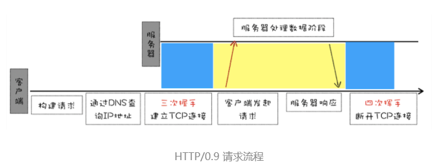
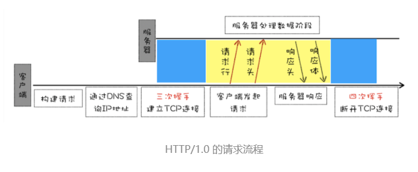
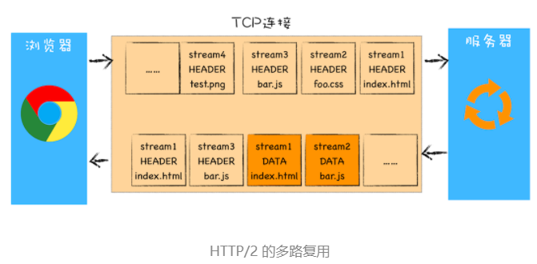

# HTTP专题

## HTTP/1：HTTP性能优化

#### 1、超文本传输协议HTTP/0.9

​	HTTP/0.9的请求流程：

- 因为 HTTP 都是基于 TCP 协议的，所以客户端先要根据 IP 地址、端口和服务器建立 TCP 连接，而建立连接的过程就是 TCP 协议三次握手的过程。
- 建立好连接之后，会发送一个 GET 请求行的信息，如`GET /index.html`用来获取 index.html。
- 服务器接收请求信息之后，读取对应的 HTML 文件，并将数据以 ASCII 字符流返回给客户端。
- HTML 文档传输完成后，断开连接。

HTTP/0.9 的实现有以下三个特点：

- 第一个是只有一个请求行，并没有**HTTP 请求头和请求体**，因为只需要一个请求行就可以完整表达客户端的需求了。
- 第二个是服务器也**没有返回头信息**，这是因为服务器端并不需要告诉客户端太多信息，只需要返回数据就可以了。
- 第三个是返回的**文件内容是以 ASCII 字符流来传输的**，因为都是 HTML 格式的文件，所以使用 ASCII 字节码来传输是最合适的。

#### 2、HTTP/1.0

HTTP/1.0请求流程如下：

1、**引入了请求头和响应头**，在发起请求时候会通过 HTTP 请求头告诉服务器它期待服务器返回什么类型的文件、采取什么形式的压缩、提供什么语言的文件以及文件的具体编码。

2、在请求头中加入了**用户代理**的字段，以便服务器统计客户端的基础信息。

3、**在响应行中引入了状态码**，告诉浏览器服务器处理请求的情况。

4、提供了**Cache 机制**，用来缓存已经下载过的数据从而减轻服务器的压力。

5、是**非持久连接**，需要为每次HTTP通信建立并维护一个TCP链接。

#### 3、HTTP1.1

**队头阻塞**：当进行持久连接时，如果TCP通道中的某个请求因为某些原因没有及时返回，那就会阻塞后面的所有请求。

**管线化：**通过管线化的技术来解决**队头阻塞**的问题。HTTP/1.1 中的管线化是指将多个 HTTP 请求整批提交给服务器的技术，虽然可以整批发送请求，不过服务器依然需要根据请求顺序来回复浏览器的请求。

**HTTP1.1的特点：**

1、**支持长连接**，且当前浏览器对于同一个域名，默认允许同时最多建立6个TCP连接。

2、在请求头中增加了**Host字段**，可传输主机名。

3、引入了**Chunk transfer机制**，服务器会将数据分割成若干个任意大小的数据块，每个数据块发送时都会附带上上一个数据块的长度，最后通过一个零长度的快作为发送数据完成的标志。

4、引入了客户端**Cookie机制**和**安全机制**。

## HTTP/2：如何提升网络速度？

**带宽**：**每秒最大能发送或者接收的字节数**。把每秒能发送的最大字节数称为**上行带宽**，每秒能够接收的最大字节数称为**下行带宽**。

**慢启动**：一旦一个 TCP 连接建立之后，就进入了发送数据状态，刚开始 TCP 协议会采用一个非常慢的速度去发送数据，然后慢慢加快发送数据的速度，直到发送数据的速度达到一个理想状态，我们把这个过程称为慢启动。慢启动是 TCP 为了减少**网络拥塞**的一种策略。

 HTTP/1.1 所存在的一些主要问题：慢启动和 TCP 连接之间相互竞争带宽是由于 TCP 本身的机制导致的，而队头阻塞是由于 HTTP/1.1 的机制导致的。

HTTP/2 的解决方案可以总结为：**一个域名只使用一个 TCP 长连接和消除队头阻塞问题**。

**HTTP/2.0的特点：**

1、二进制分帧，应用层（HTTP）和传输层（TCP）之间增加一个二进制分帧层，将所有传输的信息分为更小的消息和帧，以二进制编码格式传输数据。

2、**多路复用**，可以通过一个TCP连发送多个请求，为每个请求都分配一个对应的ID，可以优先处理关键资源的请求。

3、**服务器端推送，**如用户请求一个Html页面之后，服务器知道这个HTML页面会引用几个重要的js和CSS文件，那么在接收到HTML的请求后就会附带将要使用的这几个JS和CSS文件一块发送给浏览器。

4、**头部压缩**，对请求头和响应头进行了压缩。

## HTTP/3：甩掉TCP、TLS的包袱，构建高效的网络

**队头阻塞：**在 TCP 传输过程中，由于单个数据包的丢失而造成的阻塞称为 TCP 上的队头阻塞。如果在数据传输的过程中，有一个数据因为网络故障或者其他原因而丢包了，那么整个 TCP 的连接就会处于暂停状态，需要等待丢失的数据包被重新传输过来。

**网络延迟又称为 RTT（Round Trip Time）**：把从浏览器发送一个数据包到服务器，再从服务器返回数据包到浏览器的整个往返时间称为 RTT。

**HTTP/3的特点：**

**采用QUIC协议作为传输协议**，基于UDP来实现多路复用、可靠传输等性能，使得可以在切换网络的情况下保持连接。QUIC协议集成了以下几点功能：

- **加密请求报文**，集成了 TLS 加密功能
- **实现多路复用**
- **实现快速握手功能**，可以在0/1 RTT建联
- **具有向前纠错机制**

## HTTPS

非对称加密算法：RSA
对称加密算法：DES、AES、RC4	

​	HTTP协议传输的数据都是未加密的，也就是明文的，因此为了保证传输的隐私性，在http的基础引入了SSL，从而诞生了HTTPS。https采用混合加密，使用非对称加密来传输对称加密的密钥以保证通信的安全，然后使用对称加密的方式进行通讯保证了通信的效率。

具体流程如下：
1、浏览器向服务器发送请求，请求包括浏览器支持的协议，并附带一个随机数。
2、服务器接收到请求后，会选择一个非对称加密的算法，把数字证书签名公钥，身份信息都发送给服务器，同时也发送一个随机数。
3、浏览器收到后，验证证书的真实性，用服务器的数字签名公钥发送握手信息给服务器。
4、服务器解密之后，使用之前的随机数生成一个对称密钥，并把这个对称密钥发送给浏览器。
5、之后所有的通信都是基于对称加密的。