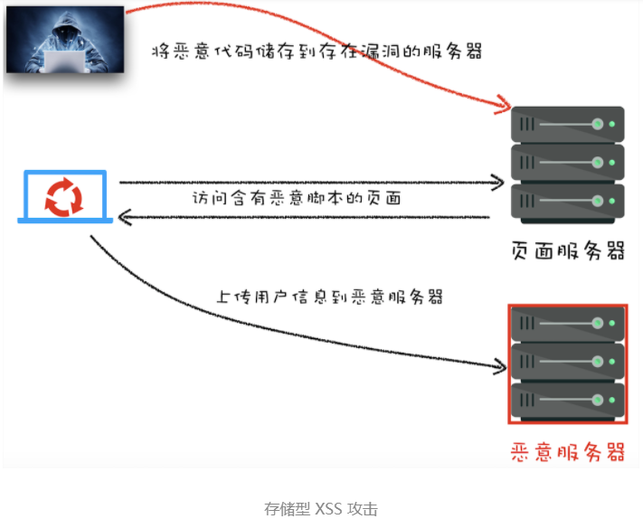
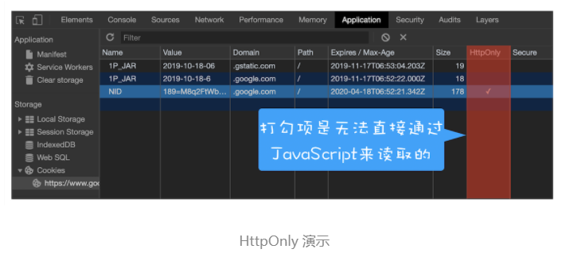
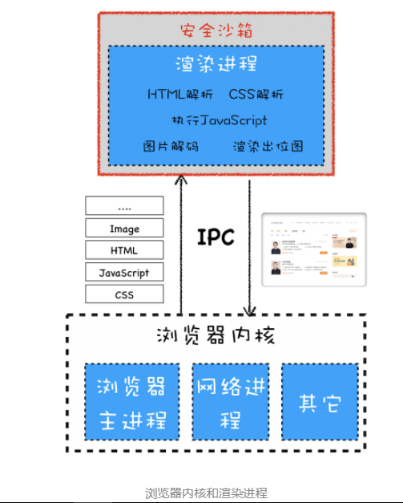
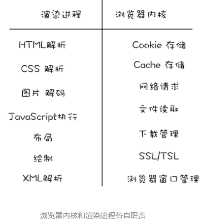
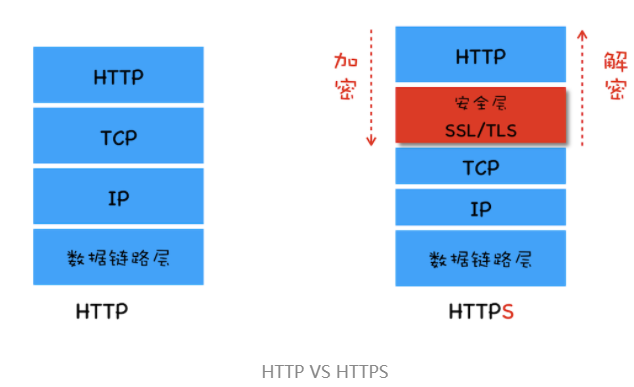

## 同源策略

**同源策略：**同协议、同域名、同端口号

同源策略主要表现在三个层面：

**第一个，DOM 层面**。同源策略限制了来自不同源的 JavaScript 脚本对当前 DOM 对象读和写的操作。

**第二个，数据层面**。同源策略限制了不同源的站点读取当前站点的 Cookie、IndexDB、LocalStorage 等数据。

**第三个，网络层面**。同源策略限制了通过 XMLHttpRequest 等方式将站点的数据发送给不同源的站点。

为了保证Web项目的开发和使用，我们不得不让出一些安全策略：

​	**1、页面中可以嵌入第三方资源**

​	为了页面中能够引用任意的第三方资源我们引入**内容安全策略**（CSP）

​	**CSP（内容安全策略） 的核心思想是让服务器决定浏览器能够加载哪些资源，让服务器决定浏览器是否能够执行内联 JavaScript 代码**。

​	**2. 跨域资源共享和跨文档消息机制**

​	为了跨站请求其他站点的资源，我们引入了**跨域资源共享（CORS）**，使用该机制可以进行跨域访问控制，从而使跨域数据传输得以安全进行。

​	在介绍同源策略时，我们说明了如果两个页面不是同源的，则无法相互操纵 DOM。不过在实际应用中，经常需要两个不同源的 DOM 之间进行通信，于是浏览器中又引入了**跨文档消息机制**，可以通过 window.postMessage 的 JavaScript 接口来和不同源的 DOM 进行通信。


## 跨站脚本攻击（XSS）

由于支持页面中的第三方资源的引用和CROS（跨站资源共享），带来了很多安全问题，其中最典型的就是XSS。

XSS全称是 Cross Site Scripting，为了与“CSS”区分开来，故简称 XSS，翻译过来就是“跨站脚本”。

**XSS 攻击是指黑客往 HTML 文件中或者 DOM 中注入恶意脚本，从而在用户浏览页面时利用注入的恶意脚本对用户实施攻击的一种手段。**

如果页面被注入了恶意脚本，恶意脚本可以做以下一些事：

- 可以**窃取 Cookie 信息**。恶意 JavaScript 可以通过“document.cookie”获取 Cookie 信息，然后通过 XMLHttpRequest 或者 Fetch 加上 CORS 功能将数据发送给恶意服务器；恶意服务器拿到用户的 Cookie 信息之后，就可以在其他电脑上模拟用户的登录，然后进行转账等操作。
- 可以**监听用户行为**。恶意 JavaScript 可以使用“addEventListener”接口来监听键盘事件，比如可以获取用户输入的信用卡等信息，将其发送到恶意服务器。黑客掌握了这些信息之后，又可以做很多违法的事情。
- 可以通过**修改 DOM**伪造假的登录窗口，用来欺骗用户输入用户名和密码等信息。
- 还可以**在页面内生成浮窗广告**，这些广告会严重地影响用户体验。

通常情况下，主要有**存储型 XSS 攻击、反射型 XSS 攻击**和**基于 DOM 的 XSS 攻击**三种方式来注入恶意脚本。

#### 1、存储型XSS攻击



步骤如下：

- 首先黑客利用站点漏洞将一段恶意 JavaScript 代码提交到网站的数据库中；
- 然后用户向网站请求包含了恶意 JavaScript 脚本的页面；
- 当用户浏览该页面的时候，恶意脚本就会将用户的 Cookie 信息等数据上传到服务器。

#### 2、反射型XSS攻击

​	在一个反射型 XSS 攻击过程中，恶意 JavaScript 脚本属于用户发送给网站请求中的一部分，随后网站又把恶意 JavaScript 脚本返回给用户。当恶意 JavaScript 脚本在用户页面中被执行时，黑客就可以利用该脚本做一些恶意操作。

另外需要注意的是，**Web 服务器不会存储反射型 XSS 攻击的恶意脚本，这是和存储型 XSS 攻击不同的地方**。

#### 3、基于DOM的XSS攻击

​	基于 DOM 的 XSS 攻击是不牵涉到页面 Web 服务器的。具体来讲，黑客通过各种手段将恶意脚本注入用户的页面中，比如通过网络劫持在页面传输过程中修改 HTML 页面的内容，这种劫持类型很多，有通过 WiFi 路由器劫持的，有通过本地恶意软件来劫持的，它们的共同点是在 Web 资源传输过程或者在用户使用页面的过程中修改 Web 页面的数据。

#### 阻止XSS攻击的方法：

​	存储型 XSS 攻击和反射型 XSS 攻击都是需要经过 Web 服务器来处理的，因此可以认为这两种类型的漏洞是服务端的安全漏洞。而基于 DOM 的 XSS 攻击全部都是在浏览器端完成的，因此基于 DOM 的 XSS 攻击是属于前端的安全漏洞。

​	但无论是何种类型的 XSS 攻击，它们都有一个共同点，那就是首先往浏览器中注入恶意脚本，然后再通过恶意脚本将用户信息发送至黑客部署的恶意服务器上。

**1. 服务器对输入脚本进行过滤或转码**

​	通过在服务器端将一些关键的字符进行转码，如下：

```javascript
code:<script>alert('你被 xss 攻击了')</script>
code:&lt;script&gt;alert(&#39; 你被 xss 攻击了 &#39;)&lt;/script&gt;
```

​	经过转码之后的内容，如`<script>`标签被转换为`<script>`，因此即使这段脚本返回给页面，页面也不会执行这段脚本。

**2. 充分利用 CSP**

实施严格的 CSP 可以有效地防范 XSS 攻击，具体来讲 CSP 有如下几个功能：

- 限制加载其他域下的资源文件，这样即使黑客插入了一个 JavaScript 文件，这个 JavaScript 文件也是无法被加载的；
- 禁止向第三方域提交数据，这样用户数据也不会外泄；
- 禁止执行内联脚本和未授权的脚本；
- 还提供了上报机制，这样可以帮助我们尽快发现有哪些 XSS 攻击，以便尽快修复问题。

**3、使用httponly属性**

​	由于很多 XSS 攻击都是来盗用 Cookie 的，因此还可以通过使用 HttpOnly 属性来保护我们 Cookie 的安全。

​	通常服务器可以将某些 Cookie 设置为 HttpOnly 标志，HttpOnly 是服务器通过 HTTP 响应头来设置的，set-cookie 属性值最后使用了 HttpOnly 来标记该 Cookie。顾名思义，使用 HttpOnly 标记的 Cookie 只能使用在 HTTP 请求过程中，所以无法通过 JavaScript 来读取这段 Cookie。可通过Chrome开发者工具在Application中查看。




## CSRF攻击

CSRF跨站请求伪造（ Cross-site request forgery），是指攻击者攻击者通过一些技术手段欺骗用户的浏览器去访问一个自己曾经认证过的网站，并运行一些操作。利用用户的登录状态发起的跨站请求。

简单来说就是**利用了用户的登录状态，并通过第三方的站点来做一些坏事**。

常当用户打开了黑客的页面后，黑客有三种方式去实施 CSRF 攻击：

**1.** **自动发起 Get 请求**

```javascript
<!DOCTYPE html> 
 <html> 
    <body> 
    	<h1> 黑客的站点：CSRF 攻击演示 </h1> 
		 
    </body> 
</html>
```

​	这是黑客页面的 HTML 代码，在这段代码中，黑客将转账的请求接口隐藏在 img 标签内，欺骗浏览器这是一张图片资源。当该页面被加载时，浏览器会自动发起 img 的资源请求，如果服务器没有对该请求做判断的话，那么服务器就会认为该请求是一个转账请求，于是用户账户上的 100 极客币就被转移到黑客的账户上去了。

**2.** **自动发起POST请求**

​	除了自动发送 Get 请求之外，有些服务器的接口是使用 POST 方法的，所以黑客还需要在他的站点上伪造 POST 请求，当用户打开黑客的站点时，是自动提交 POST 请求，具体的方式你可以参考下面示例代码：

```javascript
<!DOCTYPE html>
<html>
<body>
  <h1> 黑客的站点：CSRF 攻击演示 </h1>
  <form id='hacker-form' action="https://time.geekbang.org/sendcoin" method=POST>
    <input type="hidden" name="user" value="hacker" />
    <input type="hidden" name="number" value="100" />
  </form>
  <script> document.getElementById('hacker-form').submit(); </script>
</body>
</html>
```

​	该表单的内容就是极客时间的转账接口。当用户打开该站点之后，这个表单会被自动执行提交；当表单被提交之后，服务器就会执行转账操作。因此使用构建自动提交表单这种方式，就可以自动实现跨站点 POST 数据提交。

**3.** **引诱用户点击链接**

​	诱惑用户点击黑客站点上的链接，这种方式通常出现在论坛或者恶意邮件上。黑客会采用很多方式去诱惑用户点击链接，示例代码如下所示：

```javascript
<div>
   </img> 
</div> 

<div>
  <a href="https://time.geekbang.org/sendcoin?user=hacker&number=100" taget="_blank">
    点击下载美女照片
  </a>
</div>
```

​	页面上放了一张美女图片，下面放了图片下载地址，而这个下载地址实际上是黑客用来转账的接口，一旦用户点击了这个链接，那么他的极客币就被转到黑客账户上了。

如果当用户登录了极客时间，以上三种 CSRF 攻击方式中的任何一种发生时，那么服务器都会将一定金额的极客币发送到黑客账户。**和 XSS 不同的是，CSRF 攻击不需要将恶意代码注入用户的页面，仅仅是利用服务器的漏洞和用户的登录状态来实施攻击**。

**发起 CSRF 攻击的三个必要条件：**

- 第一个，目标站点一定要有 CSRF 漏洞；
- 第二个，用户要登录过目标站点，并且在浏览器上保持有该站点的登录状态；
- 第三个，需要用户打开一个第三方站点，可以是黑客的站点，也可以是一些论坛。

#### 避免CSRF方法：

##### 1. 充分利用好 Cookie 的 SameSite 属性

​	黑客会利用用户的登录状态来发起 CSRF 攻击，而**Cookie 正是浏览器和服务器之间维护登录状态的一个关键数据**，因此要阻止 CSRF 攻击，我们首先就要考虑在 Cookie 上来做文章。

在 HTTP 响应头中，通过 set-cookie 字段设置 Cookie 时，可以带上 SameSite 选项，如下：

```javascript
set-cookie: 1P_JAR=2019-10-20-06; expires=Tue, 19-Nov-2019 06:36:21 GMT; path=/;
```

**SameSite 选项通常有 Strict、Lax 和 None 三个值。**

- Strict 最为严格。如果 SameSite 的值是 Strict，那么浏览器会完全禁止第三方 Cookie。简言之，如果你从极客时间的页面中访问 InfoQ 的资源，而 InfoQ 的某些 Cookie 设置了 SameSite = Strict 的话，那么这些 Cookie 是不会被发送到 InfoQ 的服务器上的。只有你从 InfoQ 的站点去请求 InfoQ 的资源时，才会带上这些 Cookie。
- Lax 相对宽松一点。在跨站点的情况下，从第三方站点的链接打开和从第三方站点提交 Get 方式的表单这两种方式都会携带 Cookie。但如果在第三方站点中使用 Post 方法，或者通过 img、iframe 等标签加载的 URL，这些场景都不会携带 Cookie。
- 而如果使用 None 的话，在任何情况下都会发送 Cookie 数据。

##### 2. 验证请求的来源站点

​	另外一种防止 CSRF 攻击的策略，那就是**在服务器端验证请求来源的站点**。

​	**HTTP 请求头中的 Referer 和 Origin 属性**:

​	1、Referer 是 HTTP 请求头中的一个字段，记录了该 HTTP 请求的来源地址。

​		比如我从极客时间的官网打开了 InfoQ 的站点，那么请求头中的 Referer 值是极客时间的 URL。

​	在服务器端验证请求头中的 Referer 并不是太可靠，因此标准委员会又制定了**Origin 属性**，在一些重要的场合，比如通过 XMLHttpRequest、Fecth 发起跨站请求或者通过 Post 方法发送请求时，都会带上 Origin 属性。

​	2、 Origin 属性

​	Origin 属性只包含了域名信息，并没有包含具体的 URL 路径，这是 Origin 和 Referer 的一个主要区别。在这里需要补充一点，Origin 的值之所以不包含详细路径信息，是有些站点因为安全考虑，不想把源站点的详细路径暴露给服务器。

##### 3. CSRF Token

​	采用 CSRF Token 来验证，这个流程比较好理解，大致分为两步：

​	**第一步，**在浏览器向服务器发起请求时，服务器生成一个 CSRF Token。CSRF Token 其实就是服务器生成的字符串，然后将该字符串植入到返回的页面中。

```javascript
<!DOCTYPE html>
<html>
<body>
    <form action="https://time.geekbang.org/sendcoin" method="POST">
      <input type="hidden" name="csrf-token" value="nc98P987bcpncYhoadjoiydc9ajDlcn">
      <input type="text" name="user">
      <input type="text" name="number">
      <input type="submit">
    </form>
</body>
</html>

```

​	**第二步，**在浏览器端如果要发起转账的请求，那么需要带上页面中的 CSRF Token，然后服务器会验证该 Token 是否合法。如果是从第三方站点发出的请求，那么将无法获取到 CSRF Token 的值，所以即使发出了请求，服务器也会因为 CSRF Token 不正确而拒绝请求。


## 安全沙箱

​	XSS 攻击只是将恶意的 JavaScript 脚本注入到页面中，虽然能窃取一些 Cookie 相关的数据，但是 XSS 无法对操作系统进行攻击。而通过浏览器漏洞进行的攻击是可以入侵到浏览器进程内部的，可以读取和修改浏览器进程内部的任意内容，还可以穿透浏览器，在用户的操作系统上悄悄地安装恶意软件、监听用户键盘输入信息以及读取用户硬盘上的文件内容。



​	浏览器被划分为**浏览器内核**和**渲染内核**两个核心模块，其中浏览器内核是由网络进程、浏览器主进程和 GPU 进程组成的，渲染内核就是渲染进程。

#### 安全沙箱

​	由于渲染进程需要执行 DOM 解析、CSS 解析、网络图片解码等操作，如果渲染进程中存在系统级别的漏洞，那么以上操作就有可能让恶意的站点获取到渲染进程的控制权限，进而又获取操作系统的控制权限，这对于用户来说是非常危险的。**将渲染进程和操作系统隔离的这道墙就是我们要聊的安全沙箱**。

​	浏览器中的安全沙箱是利用操作系统提供的安全技术，让渲染进程在执行过程中无法访问或者修改操作系统中的数据，在渲染进程需要访问系统资源的时候，需要通过浏览器内核来实现，然后将访问的结果通过 IPC 转发给渲染进程。

> 为什么浏览器要从单进程的转变为多进程的？
>
> ​	安全沙箱最小的保护单位是进程。因为单进程浏览器需要频繁访问或者修改操作系统的数据，所以单进程浏览器是无法被安全沙箱保护的，而现代浏览器采用的多进程架构使得安全沙箱可以发挥作用。

#### 安全沙箱如何影响各个模块功能

​	如果要让安全沙箱应用在某个进程上，那么这个进程必须没有读写操作系统的功能，比如读写本地文件、发起网络请求、调用 GPU 接口等。



通过该图，我们可以看到由于渲染进程需要安全沙箱的保护，因此需要把在渲染进程内部涉及到和系统交互的功能都转移到浏览器内核中去实现。

##### 1. 持久存储

​	我们先来看看安全沙箱是如何影响到浏览器持久存储的。由于安全沙箱需要负责确保渲染进程无法直接访问用户的文件系统，但是在渲染进程内部有访问 Cookie 的需求、有上传文件的需求，为了解决这些文件的访问需求，所以现代浏览器将读写文件的操作全部放在了浏览器内核中实现，然后通过 IPC 将操作结果转发给渲染进程。

具体地讲，如下文件内容的读写都是在浏览器内核中完成的：

- 存储 Cookie 数据的读写。通常浏览器内核会维护一个存放所有 Cookie 的 Cookie 数据库，然后当渲染进程通过 JavaScript 来读取 Cookie 时，渲染进程会通过 IPC 将读取 Cookie 的信息发送给浏览器内核，浏览器内核读取 Cookie 之后再将内容返回给渲染进程。
- 一些缓存文件的读写也是由浏览器内核实现的，比如网络文件缓存的读取。

##### 2. 网络访问

​	同样有了安全沙箱的保护，在渲染进程内部也是不能直接访问网络的，如果要访问网络，则需要通过浏览器内核。不过浏览器内核在处理 URL 请求之前，会检查渲染进程是否有权限请求该 URL，比如检查 XMLHttpRequest 或者 Fetch 是否是跨站点请求，或者检测 HTTPS 的站点中是否包含了 HTTP 的请求。

##### 3. 用户交互

​	在现代浏览器中，由于每个渲染进程都有安全沙箱的保护，所以在渲染进程内部是无法直接操作窗口句柄的，这也是为了限制渲染进程监控到用户的输入事件。由于渲染进程不能直接访问**窗口句柄**，所以渲染进程需要完成以下两点大的改变。

**第一点**，渲染进程需要渲染出位图。为了向用户显示渲染进程渲染出来的位图，渲染进程需要将生成好的位图发送到浏览器内核，然后浏览器内核将位图复制到屏幕上。

**第二点**，操作系统没有将用户输入事件直接传递给渲染进程，而是将这些事件传递给浏览器内核。然后浏览器内核再根据当前浏览器界面的状态来判断如何调度这些事件，如果当前焦点位于浏览器地址栏中，则输入事件会在浏览器内核内部处理；如果当前焦点在页面的区域内，则浏览器内核会将输入事件转发给渲染进程。

#### 站点隔离（Site Isolation）

​	**所谓站点隔离是指 Chrome 将同一站点（包含了相同根域名和相同协议的地址）中相互关联的页面放到同一个渲染进程中执行。**

​	最开始 Chrome 划分渲染进程是以标签页为单位，也就是说整个标签页会被划分给某个渲染进程。但是，按照标签页划分渲染进程存在一些问题，原因就是一个标签页中可能包含了多个 iframe，而这些 iframe 又有可能来自于不同的站点，这就导致了多个不同站点中的内容通过 iframe 同时运行在同一个渲染进程中。

​	实现了站点隔离，就可以将恶意的 iframe 隔离在恶意进程内部，使得它无法继续访问其他 iframe 进程的内容，因此也就无法攻击其他站点了。


## HTTPS

#### 在HTTP协议栈中引入安全层

​	从 HTTP 协议栈层面来看，我们可以在 TCP 和 HTTP 之间插入一个安全层，所有经过安全层的数据都会被加密或者解密，你可以参考下图：



安全层有两个主要的职责：**对发起 HTTP 请求的数据进行加密操作**和**对接收到 HTTP 的内容进行解密操作**。

#### 第一版：使用对称加密

​	提到加密，最简单的方式是使用对称加密。所谓**对称加密是指加密和解密都使用的是相同的密钥**。HTTPS 首先要协商加解密方式，这个过程就是 HTTPS 建立安全连接的过程。为了让加密的密钥更加难以破解，我们让服务器和客户端同时决定密钥，具体过程如下：

- 浏览器发送它所支持的加密套件列表和一个随机数 client-random，这里的**加密套件是指加密的方法**，加密套件列表就是指浏览器能支持多少种加密方法列表。
- 服务器会从加密套件列表中选取一个加密套件，然后还会生成一个随机数 service-random，并将 service-random 和加密套件列表返回给浏览器。
- 最后浏览器和服务器分别返回确认消息。

#### 第二版：使用非对称加密

​	和对称加密只有一个密钥不同，**非对称加密算法有 A、B 两把密钥，如果你用 A 密钥来加密，那么只能使用 B 密钥来解密；反过来，如果你要 B 密钥来加密，那么只能用 A 密钥来解密**。

​	在 HTTPS 中，服务器会将其中的一个密钥通过明文的形式发送给浏览器，我们把这个密钥称为**公钥**，服务器自己留下的那个密钥称为**私钥**。顾名思义，**公钥是每个人都能获取到的，而私钥只有服务器才能知道，不对任何人公开**。

使用非对称加密的请求流程：

- 首先浏览器还是发送加密套件列表给服务器。
- 然后服务器会选择一个加密套件，不过和对称加密不同的是，使用非对称加密时服务器上需要有用于浏览器加密的公钥和服务器解密 HTTP 数据的私钥，由于公钥是给浏览器加密使用的，因此服务器会将加密套件和公钥一道发送给浏览器。
- 最后就是浏览器和服务器返回确认消息。

存在问题：

- **第一个是非对称加密的效率太低**。这会严重影响到加解密数据的速度，进而影响到用户打开页面的速度。
- **第二个是无法保证服务器发送给浏览器的数据安全**。虽然浏览器端可以使用公钥来加密，但是服务器端只能采用私钥来加密，私钥加密只有公钥能解密，但黑客也是可以获取得到公钥的，这样就不能保证服务器端数据的安全了。

#### 第三版：对称加密和非对称加密搭配使用

**在传输数据阶段依然使用对称加密，但是对称加密的密钥我们采用非对称加密来传输**。

具体流程如下：

- 首先浏览器向服务器发送对称加密套件列表、非对称加密套件列表和随机数 client-random；
- 服务器保存随机数 client-random，选择对称加密和非对称加密的套件，然后生成随机数 service-random，向浏览器发送选择的加密套件、service-random 和公钥；
- 浏览器保存公钥，并利用 client-random 和 service-random 计算出来 pre-master，然后利用公钥对 pre-master 加密，并向服务器发送加密后的数据；
- 最后服务器拿出自己的私钥，解密出 pre-master 数据，并返回确认消息。

#### 第四版：添加数字证书

​	黑客通过 DNS 劫持将极客时间官网的 IP 地址替换成了黑客的 IP 地址，这样我访问的其实是黑客的服务器了，黑客就可以在自己的服务器上实现公钥和私钥，而对浏览器来说，它完全不知道现在访问的是个黑客的站点。同理，极客时间要证明这个服务器就是极客时间的，也需要使用权威机构颁发的证书，这个权威机构称为**CA（Certificate Authority）**，颁发的证书就称为**数字证书（Digital Certificate)**。

​	数字证书有两个作用：一个是通过数字证书向浏览器证明服务器的身份，另一个是数字证书里面包含了服务器公钥。

相较于第三版的 HTTPS 协议，这里主要有两点改变：

- 服务器没有直接返回公钥给浏览器，而是返回了数字证书，而公钥正是包含在数字证书中的；
- 在浏览器端多了一个证书验证的操作，验证了证书之后，才继续后续流程。

通过引入数字证书，我们就实现了服务器的身份认证功能，这样即便黑客伪造了服务器，但是由于证书是没有办法伪造的，所以依然无法欺骗用户。

##### 如何申请数字证书

比如极客时间需要向某个 CA 去申请数字证书，通常的申请流程分以下几步：

- 首先极客时间需要准备一套私钥和公钥，私钥留着自己使用；
- 然后极客时间向 CA 机构提交公钥、公司、站点等信息并等待认证，这个认证过程可能是收费的；
- CA 通过线上、线下等多种渠道来验证极客时间所提供信息的真实性，如公司是否存在、企业是否合法、域名是否归属该企业等；
- 如信息审核通过，CA 会向极客时间签发认证的数字证书，包含了极客时间的公钥、组织信息、CA 的信息、有效时间、证书序列号等，这些信息都是明文的，同时包含一个 CA 生成的签名。

​    最后一步数字签名的过程还需要解释下：首先 CA 使用**Hash 函数**来计算极客时间提交的明文信息，并得出**信息摘要**；然后 CA 再使用它的私钥对信息摘要进行加密，**加密后的密文就是 CA 颁给极客时间的数字签名**。这就相当于房管局在房产证上盖的章，这个章是可以去验证的，同样我们也可以通过数字签名来验证是否是该 CA 颁发的。

##### 浏览器如何验证数字证书

​	浏览器接收到数字证书之后，会对数字证书进行验证。首先浏览器读取证书中相关的明文信息，采用 CA 签名时相同的 Hash 函数来计算并得到**信息摘要 A**；然后再利用对应 CA 的公钥解密签名数据，得到**信息摘要 B**；对比信息摘要 A 和信息摘要 B，如果一致，则可以确认证书是合法的，即证明了这个服务器是极客时间的；同时浏览器还会验证证书相关的域名信息、有效时间等信息。