## 高维数据可视化

### 数据维度(Data Dimension)

#### 一维(1-D)

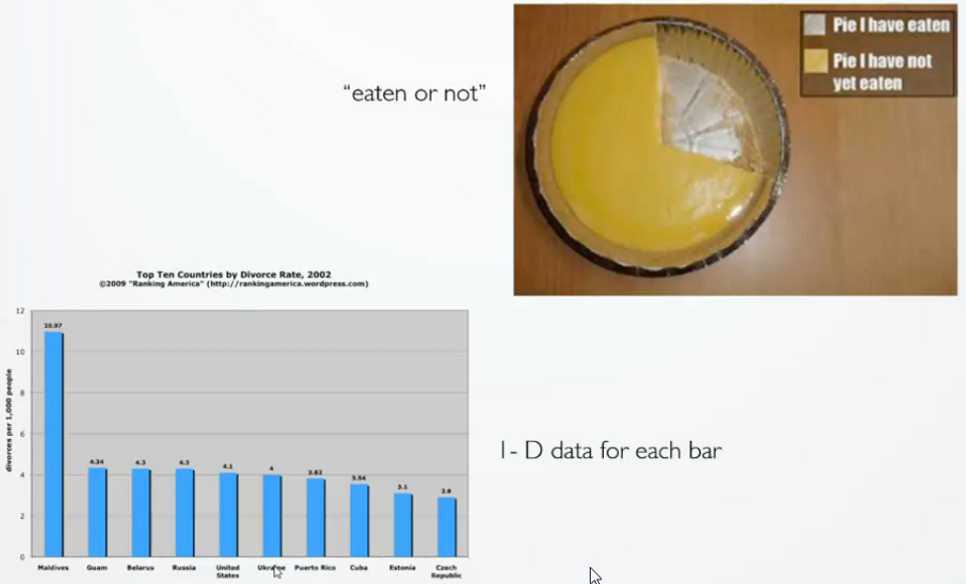

#### 二维(2-D)

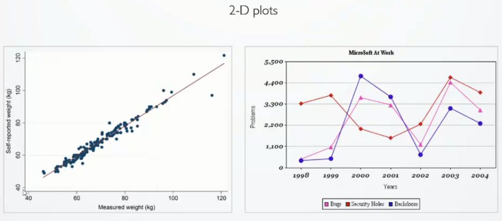

#### 三维(3-D)

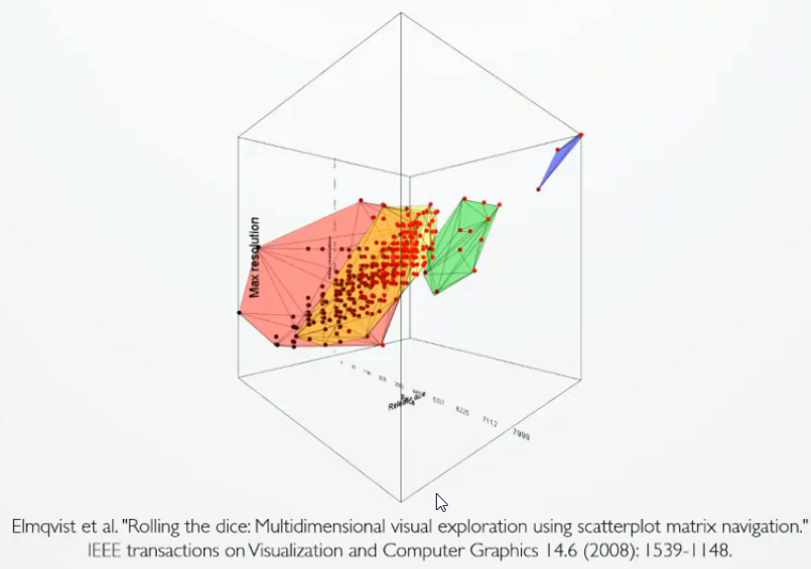

对于这种可视化的方法，它并不是一种非常好或者非常妥当的一种方法，作为可视化的专业人员会非常反对使用这种三维的数据可视化。在实际的使用或应用中，会极少的使用这种三维的散点图。因为它让我们用户去认识、感知和读出它的数据的效率是极低的。它会给人们带来非常大的偏差甚至误导， 主要有两点原因：

1. 由于它是一个三维的空间，所以我们从不同的视角上看过去，能够观察到这种数据的分布或模式是非常的不同的，这就给做数据分析带了极大的不可预测性和不确定性。
2. 由于在三维的空间，所以不可避免的有数据的遮挡的问题。

所以，如无必要尽量避免使用这种三维的可视化，除非数据本身是具有这种三维属性的。如飞机的起降数据、基于流场的可视化数据等。

#### 高维(High Dimension)

- 对于高维数据如何实现可视化？

  1. 通过增加视觉通道，如样式、颜色、大小等，以表达更多的属性信息

     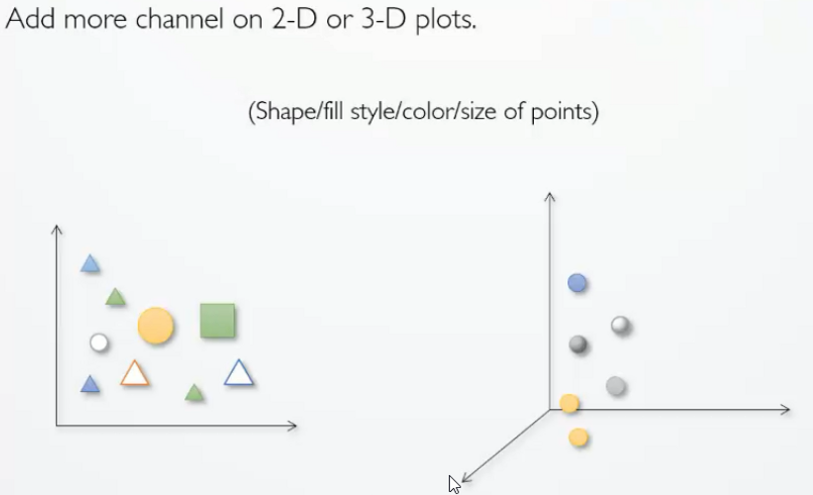

  2.  多视图协调关联的方法(Multiple coordinated view:present some attributes of objects in a view)

     ​	这种方法主要是通过在每一个视图上，分别展现相同数据集的某几个数据的维度，我们可以通过增加视图的方法来支持呈现更多的属性的可视化。下图是一个多视图协调关联的例子：

     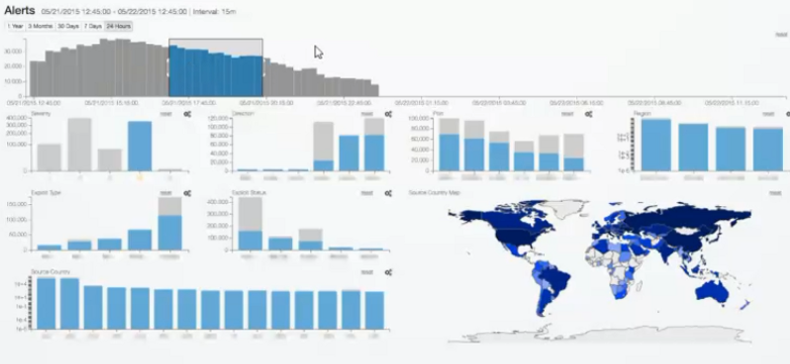

     存在的问题：有关研究/心里学表明：太多的视图很容易会造成视觉的混淆，降低分析的效率。所以在进行多视图关联时，我们在视图之间关联的选择上也是要经过慎重的考虑的。因为不同的视图之间有可能会产生相互的干扰，设置不和谐不同意。

  以上两种方法是最常见的两种处理高维数据可视化的方法，在接下来的一小节中进行重点介绍。

### 高维数据可视化(High-Dimensional Data Visualization)

下面介绍的是几类比较经典的高维数据可视化的方法，以下高维数据可视化的方法可简单分为三大类型：数据的变换、数据的呈现、数据的交互。

#### 数据的变换

- 降维(Dimensionality Reduction)

  使用各种线性的或者非线性的变换，把高维的数据通过降维或者投影的方式，从高维的空间变换到低维的空间，从而降低数据的复杂度。原因是由于高维的数据中很有可能会存在大量的冗余，这种大量的冗余很有可能隐藏了重要关系的相关性，隐藏了重要的数据规律。所以通过降维不仅仅可以消除数据的冗余，减少被处理数据的数量，而且可以方便的在低维空间上将数据呈现。因此，该方法广泛的应用于数据可视化、数据挖掘和模式识别等领域。

  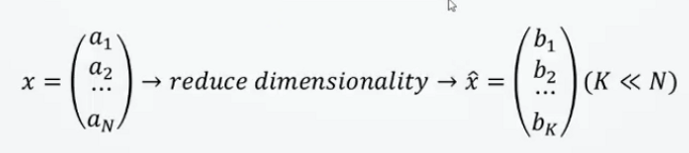

  1. 线性的方法

     - Principal Comonent Analysis (PCA)

       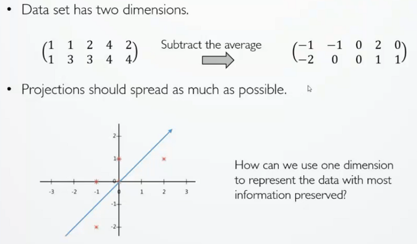

       1. 如上图所示，对于具有两个属性的数据（一行代表一个属性），首先将每个数据减去它的一个均值。

       2. 将变化后的数据放到一个坐标系上。

       3. 在二维的平面当中去选择一个方向，将这五个点都投影到这个方向所在的直线上，用投影后的值来表示原始的记录。

          如何去选择这个方向？我们希望降维后的值要尽可能的分散，而不是聚在一起

          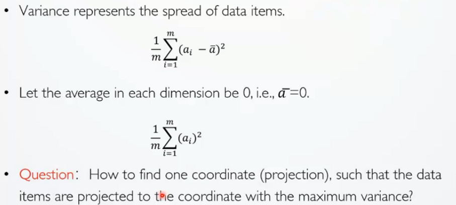

          选择一个方向，这个方向使得投影后的方差值最大。但是当维度多了之后就会出现维度的相关性，所以我们通过两个字段的协方差来表示相关性。

          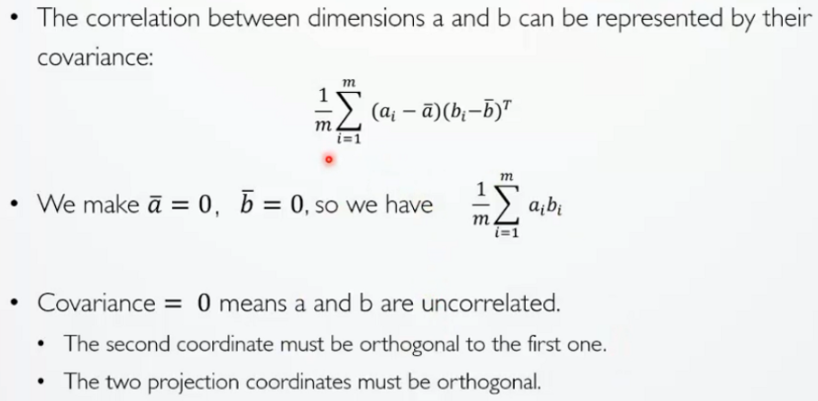

     - Multidimensional Scaling (MDS) 多尺度投影

       通过输入一个原始数据集的矩阵，这个数据集是两两数据之间的相似程度。

  2. 非线性的方法

     - ISOMAP
     - Local Linear Embedding(LLE)

#### 数据的呈现

通过一些巧妙的数据可视化的布局方法，忠实、直观、生动的展现高维数据。

- 散点图矩阵(Scatter-plot Matrix)

  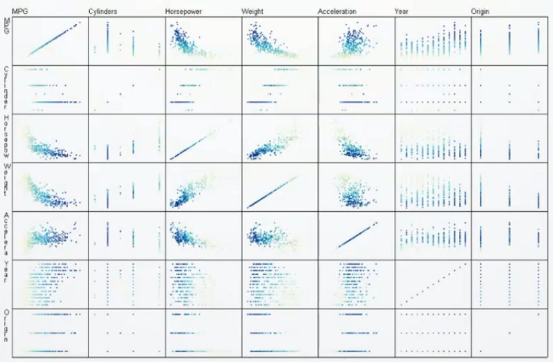

  存在的问题：当我们有很多的维度的时候，仅仅用肉眼去发现其中的规律或者模式往往比较困难，为了解决这种问题，有人就使用了一些智能的算法去自动的发现在散点图里面，哪一些散点图是更有意义的。

  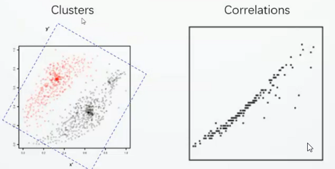

- 平行坐标轴(Parallel Coordinates)

  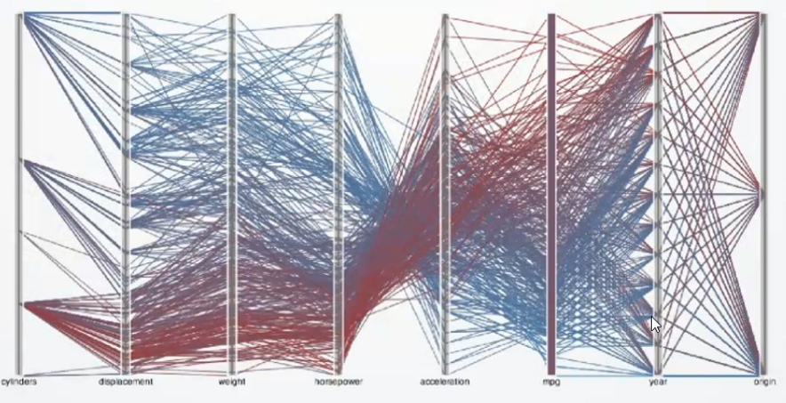

  存在的问题：当我们的数据很多时，往往会形成以下图案，我们从中发现不了它里面有什么关联（如左图），我们可以给每一个折线加一个透明度（如右图）。

  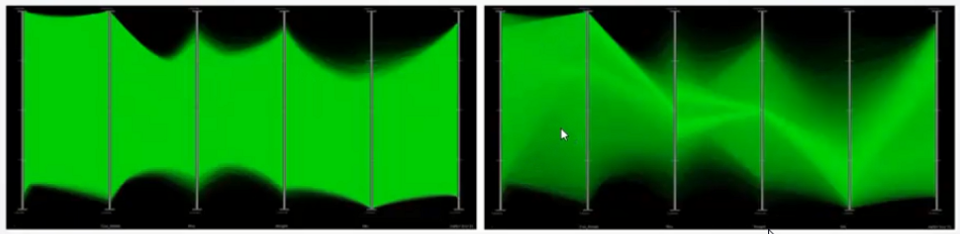

- 基于图标的方式(Glyph-based Methods)

  1. Star Plots(雷达图) 

     > 可看做平行坐标轴的一个变种

  2. Chernoff Faces(脸谱图）

     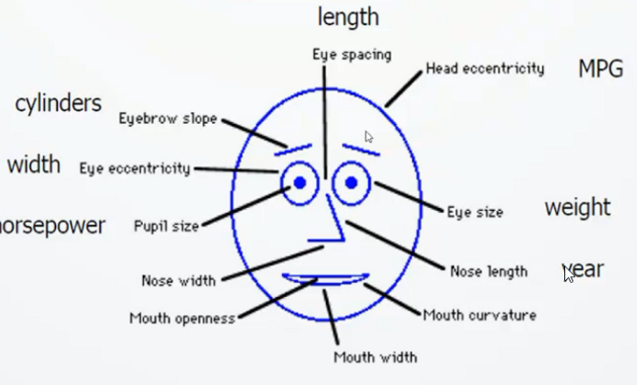

  3. Text+Glyph(将图标嵌入文本之中)

     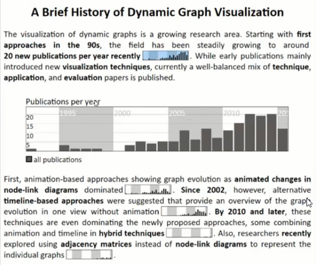

- Small Multiples(小图标法)

  用一系列的排列非常整齐的图表来做多维数据的可视化，从而方便我们进行对比，其案例主要如下：

  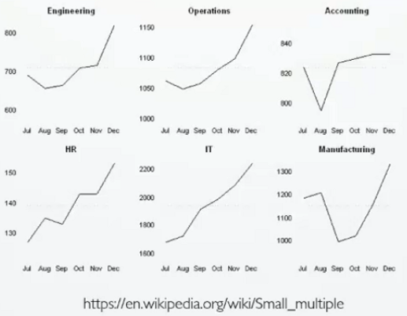

  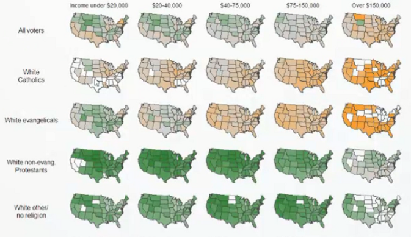

#### 数据的交互

通过有效的人机交互的技术，帮助人们交互式的探索和分析高维的数据。

- Iteraction:"Dust & Magnet"
  - 使用一个个类似于灰尘的点来代表数据点（Dust-Data points）
  - 用磁铁来代表数据属性的过滤器（Magnet-Attribute Filters）
  - 通过不断的抖动磁铁，就会把与这个磁铁相关的属性的灰尘往该磁铁的方向吸引