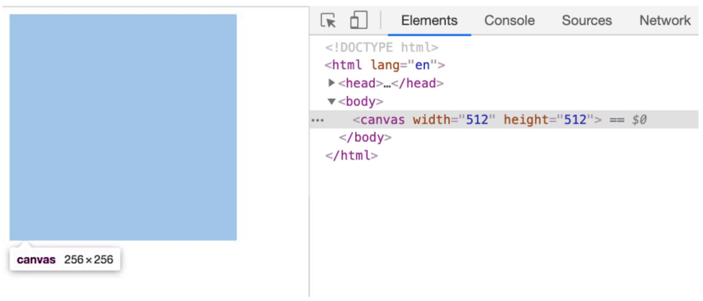
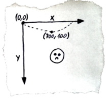
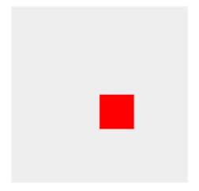
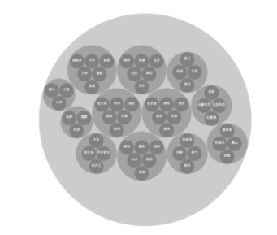

## 02 | 指令式绘图系统：如何用Canvas绘制层次关系图？

主要讲解了Canvas如何在2D上下文完成绘图，重点介绍了canvas的几种常用API，以及Canvas2D能做什么、怎么使用、局限性是什么？以及几个Canvas的例子。

#### 浏览器中使用Canvas的基础知识

1. Canvas也是HTML元素，我们可以使用canvas 标签将它插入到 HTML 内容中。

   ```html
   <style>
   	canvas {
    	 	width: 256px;
    	 	height: 256px;
   	}
    	/* 样式宽高 */
   </style>
   ......
   <body>
     <canvas width="512" height="512"></canvas> /* 画布宽高 */  
   </body>
   ```

   **需要特别注意**，Canvas 元素上的 width 和 height 属性不等同于 Canvas 元素的 CSS 样式的属性。这是因为，CSS 属性中的宽高影响 Canvas 在页面上呈现的大小，而 HTML 属性中的宽高则决定了 Canvas 的坐标系。为了区分它们，我们称 Canvas 的 HTML 属性宽高为**画布宽高**，CSS 样式宽高为**样式宽高**。

   

   因为画布宽高决定了可视区域的坐标范围，所以 Canvas 将画布宽高和样式宽高分开的做法，能更方便地适配不同的显示设备。

   > 要在画布宽高为 500*500 的 Canvas 画布上，绘制一个居中显示的 100*100 宽高的正方形。我们只要将它的坐标设置在 x = 200, y = 200 处即可。这样，不论这个 Canvas 以多大的尺寸显示在各种设备上，我们的代码都不需要修改。否则，如果 Canvas 的坐标范围（画布宽高）跟着样式宽高变化，那么当屏幕尺寸改变的时候，我们就要重新计算需要绘制的图形的所有坐标，这对于我们来说将会是一场“灾难”。

2. Canvas的坐标系。

   Canvas 的坐标系和浏览器窗口的坐标系类似，默认左上角为坐标原点，x 轴水平向右，y 轴垂直向下。那在我们设置好的画布宽高为 512*512 的 Canvas 画布中，它的左上角坐标值为（0,0），右下角坐标值为（512,512） 。

   

#### Canvas的基础用法

1. 获取Canvas的上下文。获取 Canvas 上下文也需要两个步骤
   1. 获取Canvas元素。我们可以通过 DOM API 获取它，代码如下：

      ```js
      const canvas = document.querySelector('canvas');
      ```

   2. 通过 getContext 方法拿到它的上下文对象。

      ```js
      const context = canvas.getContext('2d');
      ```

2. 利用上下文绘制图像。

   context 对象上会有许多 API，它们大体上可以分为两类：一类是设置状态的 API，可以设置或改变当前的绘图状态，比如，改变要绘制图形的颜色、线宽、坐标变换等等；另一类是绘制指令 API，用来绘制不同形状的几何图形。

   1. 通过计算得到Canvas的画布中心点。由于Canvas 坐标系的左上角坐标是 (0,0)，右下角是 Canvas 的画布坐标，即 （canvas.width,canvas.height），所以画布的中心点坐标是（0.5 *canvas.width, 0.5 * canvas.height）。

   2. 在中心点绘制一个100*100的正方形的Canvas指令：

      ```js
      context.rect(0.5 * canvas.width, 0.5 * canvas.height, 100, 100);
      ```

   3. 将正方形填充成红色，这一步通过调用 context.fillStyle 指令就可以完成。然后，我们要调用一个 beginPath 的指令，告诉 Canvas 我们现在绘制的路径。接着，才是调用 rect 指令完成绘图。最后，我们还要调用 fill 指令，将绘制的内容真正输出到画布中。代码如下：

      ```js
      const rectSize = [100, 100];
      context.fillStyle = 'red';
      context.beginPath();
      context.rect(0.5 * canvas.width, 0.5 * canvas.height, ...rectSize);
      context.fill();
      ```

      

   4. 正方形并没有居于画布的正中心。这是由于我们是让正方形的左上顶点居于画布的正中心而不是让正方形的中心居于画布的中心。解决方法有两种，如下所示：

      1. 可以让 rect 指令的 x、y 参数，等于画布宽高的一半分别减去矩形自身宽高的一半。这样，我们就把正方形的中心点真正地移动到画布中心了。

         ```js
         context.rect(0.5 * (canvas.width - rectSize[0]), 0.5 * (canvas.height - rectSize[1]), ...rectSize);
         ```

      2. 可以先给画布设置一个平移变换（Translate），然后再进行绘制。代码如下所示：

         ```js
         context.translate(-0.5 * rectSize[0], -0.5 * rectSize[1]);
         ```

   5. 那怎么把画布状态恢复回来呢？恢复画布状态的方式有两种，如下所示：

      1. 第一种是反向平移

         ```js
         // 平移
         context.translate(-0.5 * rectSize[0], -0.5 * rectSize[1]);
         ... 执行绘制
         // 恢复
         context.translate(0.5 * rectSize[0], 0.5 * rectSize[1]);
         ```

      2. Canvas 上下文还提供了 save 和 restore 方法，可以暂存和恢复画布某个时刻的状态。其中，save 指令不仅可以保存当前的 translate 状态，还可以保存其他的信息，比如，fillStyle 等颜色信息。 而 restore 指令则可以将状态指令恢复成 save 指令前的设置。操作代码如下：

         ```js
         context.save(); // 暂存状态
         // 平移
         context.translate(-0.5 * rectSize[0], -0.5 * rectSize[1]);
         ... 执行绘制
         context.restore(); // 恢复状态
         ```

   **总结：**

   这个过程总结为了 5 个步骤：

   1. 获取 Canvas 对象，通过 getContext(‘2d’) 得到 2D 上下文；
   2. 设置绘图状态，比如填充颜色 fillStyle，平移变换 translate 等等；
   3. 调用 beginPath 指令开始绘制图形；
   4. 调用绘图指令，比如 rect，表示绘制矩形；
   5. 调用 fill 指令，将绘制内容真正输出到画布上。

#### 使用Canvas绘制层次关系图

绘制出的层次关系图效果如下：




数据格式如下：

```json

{
  "name":"中国",
  "children":
  [
    { 
      "name":"浙江" , 
        "children":
        [
            {"name":"杭州" },
            {"name":"宁波" },
            {"name":"温州" },
            {"name":"绍兴" }
        ] 
      },
    { 
      "name":"广西" , 
      "children":
      [
        {"name":"桂林"},
        {"name":"南宁"},
        ...
    }
  ]
}
```

数据转换：使用d3-hierarchy [d3-hierarchy](https://github.com/d3/d3-hierarchy)把数据转换成图形信息。

```js
const dataSource = 'https://s5.ssl.qhres.com/static/b0695e2dd30daa64.json';
(async function () {
  const data = await (await fetch(dataSource)).json();
  const regions = d3.hierarchy(data)
    .sum(d => 1)
    .sort((a, b) => b.value - a.value);
  const pack = d3.pack()
    .size([1600, 1600])
    .padding(3);
  const root = pack(regions);
}());
```

假设，我们要将它们展现在一个画布宽高为 1600 * 1600 的 Canvas 中，那我们可以通过 d3.pack() 将数据映射为一组 1600 宽高范围内的圆形。不过，为了展示得美观一些，在每个相邻的圆之间我们还保留 3 个像素的 padding（按照经验，我们一般是保留 3 个像素 padding 的，但这也要根据实际的设计需求来更改）。此时它的内部结构如下所示：

```js
{
  data: {name: '中国', children: [...]},
  children: [
    {
      data: {name: '江苏', children: [...]},
      value: 7,
      r: 186.00172579386546,
      x: 586.5048250548921,
      y: 748.2441892254667,
    }
    ...
  ],
  value: 69,
  x: 800,
  y: 800,
  r: 800,
}
```

我们需要的信息是数据中的 x、y、r，这些数值是前面调用 d3.hierarchy 帮我们算出来的。接下来我们只需要用 Canvas 将它们绘制出来就可以了。具体绘制过程比较简单，只需要遍历数据并且根据数据内容绘制圆弧，我也把它总结成了两步：

1. 第一步：我们在当前数据节点绘制一个圆，圆可以使用 arc 指令来绘制。arc 方法的五个参数分别是圆心的 x、y 坐标、半径 r、起始角度和结束角度，前三个参数就是数据中的 x、y 和 r。因为我们要绘制的是整圆，所以后面的两个参数中起始角是 0，结束角是 2π。

2. 第二步，绘制图成后，如果这个数据节点有下一级数据，我们遍历它的下一级数据，然后递归地对这些数据调用绘图过程。如果没有下一级数据，说明当前数据为城市数据，那么我们就直接给出城市的名字，这一步可以通过 fillText 指令来完成。具体的代码如下所示：

   ```js
   const TAU = 2 * Math.PI;
   function draw(ctx, node, {fillStyle = 'rgba(0, 0, 0, 0.2)', textColor = 'white'} = {}){
     const children = node.children;
     const {x, y, r} = node;
     ctx.fillStyle = fillStyle;
     ctx.beginPath();
     ctx.arc(x, y, r, 0, TAU);
     ctx.fill();
     if(children) {
       for(let i = 0; i < children.length; i++) {
         draw(ctx, children[i]);
       }
     } else {
       const name = node.data.name;
       ctx.fillStyle = textColor;
       ctx.font = '1.5rem Arial';
       ctx.textAlign = 'center';
       ctx.fillText(name, x, y);
     }
   }
   draw(context, root);
   ```

#### Canvas的优缺点

**优点：**Canvas 渲染起来相当高效。即使是绘制大量轮廓非常复杂的几何图形，Canvas 也只需要调用一组简单的绘图指令就能高性能地完成渲染。这个呀，其实和 Canvas 更偏向于渲染层，能够提供底层的图形渲染 API 有关。那在实际实现可视化业务的时候，Canvas 出色的渲染能力正是它的优势所在。

**缺点：**因为 Canvas 在 HTML 层面上是一个独立的画布元素，所以所有的绘制内容都是在内部通过绘图指令来完成的，绘制出的图形对于浏览器来说，只是 Canvas 中的一个个像素点，我们很难直接抽取其中的图形对象进行操作。比如说，在 HTML 或 SVG 中绘制一系列图形的时候，我们可以一一获取这些图形的元素对象，然后给它们绑定用户事件。但同样的操作在 Canvas 中没有可以实现的**简单方法**。