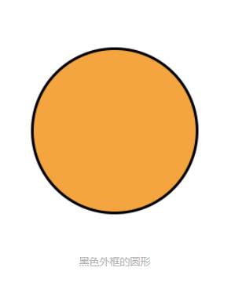
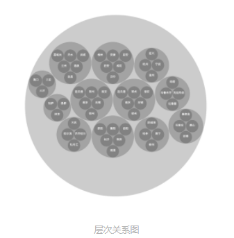
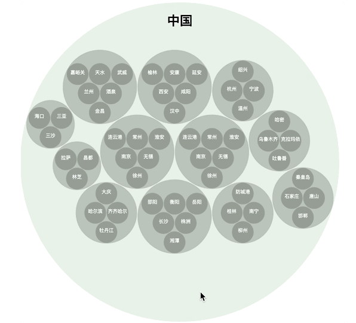

## 03 | 声明式图形系统：如何用SVG图形元素绘制可视化图表？

SVG 的全称是 Scalable Vector Graphics，可缩放矢量图，它是浏览器支持的一种基于 XML 语法的图像格式。SVG的XML语言本身和HTML非常接近，都是由标签+属性组成。

#### 利用SVG绘制几何图形

SVG属于**声明式绘图系统**，它的绘制方式和Canvas不同，它不需要用JavaScipt指令操作绘图指令，只需要和HTML一样，声明一些标签就可以了。

一个声明的例子：

```html
<svg xmlns="http://www.w3.org/2000/svg" version="1.1">
  <circle cx="100" cy="50" r="40" stroke="black" stroke-width="2" fill="orange" />
</svg>
```

- svg元素是SVG的根元素，xmlns属性是xml的名字空间
- 第一行的代码表示svg的xmlns属性值是http://www.w3.org/2000/svg，浏览器会根据这个属性值识别出这是一段SVG的内容。
- svg元素下的circle元素表示这是一个绘制在SVG图像上的圆形
- 属性值cx和cy是坐标，表示圆心的位置在图像的x=100,y=50处，r=40表示圆形的半径为40；
- SVG 坐标系和 Canvas 坐标系完全一样，都是以图像左上角为原点，x 轴向右，y 轴向下的左手坐标系。
- SVG坐标与浏览器的像素对应，所以100,50,40的单位都是px

在Canvas中，为了让绘制出来的图形**适配不同的显示设备**，我们要设置Canvas画布坐标。同理，我们也可以通过给 svg 元素设置 **viewBox** 属性，来改变 SVG 的坐标系。



#### 利用SVG实现层次关系图

1. 通过选择器来获得SVG对象

   ```js
   const svgroot = document.querySelector('svg');
   ```

2. 同样使用draw方法从root开始遍历数据对象。不同的是，在Canvas 2D中我们通过调用绘图指令来绘图，而在SVG是通过创建SVG元素，然后将其添加到DOM文档里，让图形显示出来的。

   ```js
   //Canvas 2D
   const TAU = 2 * Math.PI;
   function draw(ctx, node, {fillStyle = 'rgba(0, 0, 0, 0.2)', textColor = 'white'} = {}){
     const children = node.children;
     const {x, y, r} = node;
     ctx.fillStyle = fillStyle;
     ctx.beginPath();
     ctx.arc(x, y, r, 0, TAU);
     ctx.fill();
     if(children) {
       for(let i = 0; i < children.length; i++) {
         draw(ctx, children[i]);
       }
     } else {
       const name = node.data.name;
       ctx.fillStyle = textColor;
       ctx.font = '1.5rem Arial';
       ctx.textAlign = 'center';
       ctx.fillText(name, x, y);
     }
   }
   draw(context, root);
   ```

   ```js
   //SVG 
   function draw(parent, node, {fillStyle = 'rgba(0, 0, 0, 0.2)', textColor = 'white'} = {}) {
       const children = node.children;
       const {x, y, r} = node;
       const circle = document.createElementNS('http://www.w3.org/2000/svg', 'circle');
       circle.setAttribute('cx', x);
       circle.setAttribute('cy', y);
       circle.setAttribute('r', r);
       circle.setAttribute('fill', fillStyle);
       parent.appendChild(circle);
       if(children) { 
         	const group = document.createElementNS('http://www.w3.org/2000/svg', 'g');
         	for(let i = 0; i < children.length; i++) {
           	draw(group, children[i], {fillStyle, textColor});
         	}
         	group.setAttribute('data-name', node.data.name);
         	parent.appendChild(group);
       }else { 
           const text = document.createElementNS('http://www.w3.org/2000/svg', 'text');
         	text.setAttribute('fill', textColor);
         	text.setAttribute('font-family', 'Arial');
         	text.setAttribute('font-size', '1.5rem');
         	text.setAttribute('text-anchor', 'middle');
         	text.setAttribute('x', x);
         	text.setAttribute('y', y);
         	const name = node.data.name;
         	text.textContent = name;
         	parent.appendChild(text);
       }
   }
   draw(svgroot, root);
   ```

   - 使用 **document.createElementNS 方法**来创建 SVG 元素，与使用 document.createElement 方法创建普通的 HTML 元素不同，SVG 元素要使用 document.createElementNS 方法来创建。
   - 第一个参数是名字空间，第二个参数是要创建的元素标签名，因为要绘制圆型，所以我们还是创建 circle 元素
   - 将 x、y、r 分别赋给 circle 元素的 cx、cy、r 属性
   - 将 fillStyle 赋给 circle 元素的 fill 属性
   - 将 circle 元素添加到它的 parent 元素
   - 创建一个 SVG 的 g 元素，递归地调用 draw 方法。SVG 的 g 元素表示一个分组，我们可以用它来对 SVG 元素建立起层级结构。而且，如果我们给 g 元素设置属性，那么它的子元素会继承这些属性。
   - 如果下一级没有数据了，那我们还是需要给它添加文字

   

   

#### SVG 和 Canvas 的不同点

SVG 和 Canvas 在使用上的不同主要可以分为两点，分别是**写法上的不同**和**用户交互实现上的不同**。

1. 写法上的不同

   - SVG 是以创建图形元素绘图的“声明式”绘图系统，Canvas 是执行绘图指令绘图的“指令式”绘图系统。
   - SVG 首先通过创建标签来表示图形元素，circle 表示圆，g 表示分组，text 表示文字。接着，SVG 通过元素的 setAttribute 给图形元素赋属性值，这个和操作 HTML 元素是一样的。而 Canvas 先是通过上下文执行绘图指令来绘制图形，画圆是调用 context.arc 指令，然后再调用 context.fill 绘制，画文字是调用 context.fillText 指令。另外，Canvas 还通过上下文设置状态属性，context.fillStyle 设置填充颜色，conext.font 设置元素的字体。我们设置的这些状态，在绘图指令执行时才会生效。

   ​    从写法上来看，因为 SVG 的声明式类似于 HTML 书写方式，本身对前端工程师会更加友好。但是，SVG 图形需要**由浏览器负责渲染和管理**，将元素节点维护在 DOM 树中。这样做的缺点是，**在一些动态的场景中，也就是需要频繁地增加、删除图形元素的场景中，SVG 与一般的 HTML 元素一样会带来 DOM 操作的开销**，所以 SVG 的**渲染性能相对比较低**。

2. 用户交互实现上的不同

   因为 SVG 的一个图形对应一个元素，所以我们可以像处理 DOM 元素一样，很容易地给 SVG 图形元素添加对应的鼠标事件。

   1. 给 SVG 的根元素添加 mousemove 事件。像是我们熟悉的 HTML 用法一样，我们通过事件冒泡可以处理每个圆上的鼠标事件，当前鼠标所在的圆的颜色填充成rgba(0, 128, 0, 0.1)，这个颜色是带透明的浅绿色。

      ```js
      let activeTarget = null;
      svgroot.addEventListener('mousemove', (evt) => {
          let target = evt.target;
          if(target.nodeName === 'text') 
              target = target.parentNode;
          if(activeTarget !== target) {
              if(activeTarget) 
                  activeTarget.setAttribute('fill', 'rgba(0, 0, 0, 0.2)');
          }
          target.setAttribute('fill', 'rgba(0, 128, 0, 0.1)');
          activeTarget = target;
      });
      ```

   2. 实现显示对应的省 - 市信息

      1. 第一步，是把省、市信息通过扩展属性 data-name 设置到 svg 的 circle 元素上，这样我们就可以在移动鼠标的时候，通过读取鼠标所在元素的属性，拿到我们想要展示的省、市信息了。

         ```js
         function draw(parent, node, {fillStyle = 'rgba(0, 0, 0, 0.2)', textColor = 'white'} = {}) {
             ...
             const circle = document.createElementNS('http://www.w3.org/2000/svg', 'circle');
             ...
             circle.setAttribute('data-name', node.data.name);
             ...
             
             if(children) {
              const group = document.createElementNS('http://www.w3.org/2000/svg', 'g');
               ...
               group.setAttribute('data-name', node.data.name);
               ...
             } else {
               ...
             }
           }
         ```

      2. 我们要实现一个 getTitle 方法，从当前鼠标事件的 target 往上找 parent 元素，拿到“省 - 市”信息，把它赋给 titleEl 元素。这个 titleEl 元素是我们添加到网页上的一个 h1 元素，用来显示省、市信息。

         ```js
         const titleEl = document.getElementById('title');
         function getTitle(target) {
             const name = target.getAttribute('data-name');
             if(target.parentNode && target.parentNode.nodeName === 'g') {
               const parentName = target.parentNode.getAttribute('data-name');
               return `${parentName}-${name}`;
             }
             return name;
         }
         ```

      3. 在 mousemove 事件中更新 titleEl 的文本内容

         ```js
         svgroot.addEventListener('mousemove', (evt) => {
             ...
             titleEl.textContent = getTitle(target);
             ...
         });
         ```

   

**总结**，利用 SVG 的一个图形对应一个 svg 元素的机制，我们就可以像操作普通的 HTML 元素那样，给 svg 元素添加事件实现用户交互了。所以，SVG 有一个非常大的优点，那就是可以让图形的用户交互非常简单。

#### 绘制大量几何图形时 SVG 的性能问题

1. SVG以节点的形式呈现在HTML文本内容中，依靠浏览器的DOM渲染树。当绘制的图形非常复杂的时候，这些元素节点的数量就会非常的多。而节点的数量一多就会增加DOM树渲染和重绘的时间。事实上，在一般情况下，当 SVG 节点超过一千个的时候，你就能很明显感觉到性能问题了。
2. **性能解决方案**：可以使用虚拟 DOM 方案来尽可能地减少重绘，这样就可以优化 SVG 的渲染。但是这些方案只能解决一部分问题，当节点数太多时，这些方案也无能为力。
3. SVG 除了嵌入 HTML 文档的用法，还可以直接作为一种图像格式使用。所以，即使是在用 Canvas 和 WebGL 渲染的应用场景中，我们也依然可能会用到 SVG，将它作为一些局部的图形使用，这也会给我们的应用实现带来方便。

