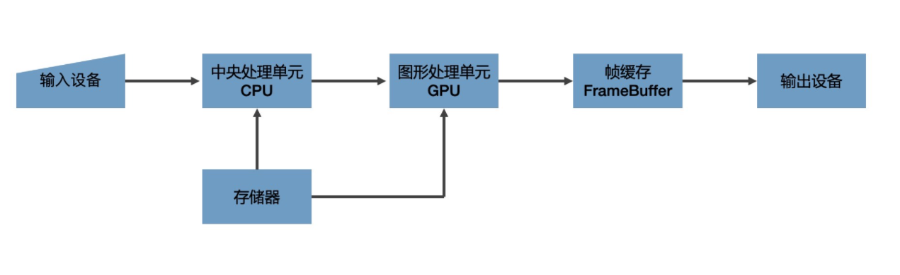

## 04 | GPU与渲染管线：如何用WebGL绘制最简单的几何图形？

WebGL的两大特点：

1. WebGL这种技术本身就是用来解决最复杂的视觉呈现的。如大批量的绘制复杂图像和3D模型，这类比较有难度的问题适合用WebGL来解决。
2. WebGL相对于其他图形来说是一个更开放的系统。

### 计算机图形系统的基本原理

一个通用的计算机图形系统主要包括6个部分，分别是输入设备、中央处理单元、图形处理单元、存储器、帧缓存和输出设备。

- **光栅（Raster）**：几乎所有的现代图形系统都是基于光栅来绘制图形的，光栅就是指构成图像的像素阵列。

- **像素（Pixel）**：一个像素对应图像上的一个点，它通常保存图像上的某个具体位置的颜色等信息。

- **帧缓存（Frame Buffer）**：在绘图过程中，像素信息被存放于帧缓存中，帧缓存是一块内存地址。

- **CPU（Central Processing Unit）**：中央处理单元，负责逻辑计算。

- **GPU（Graphics Processing Unit）**：图形处理单元，负责图形计算。



一个典型的绘图过程：

1. 数据经过CPU处理，成为具有特定结构的几何信息。
2. 这些信息被送到GPU中进行处理，在GPU中要经过两步生成光栅信息，这些光栅信息会输出到帧缓存中。
3. 最后渲染到屏幕上。

**渲染管线：**对给定数据结合绘图的特定场景要素（例如相机、光源、遮挡物体等等）进行计算，最终将图形变为屏幕空间的2D坐标。然后为屏幕空间的每个像素点进行着色，把最终完成的图形输出到显示设备上。这整个过程是一步一步进行的，前一步输出就是后一步的输入，所以我们把这个过程叫做**渲染管线**。

### 使用WebGL绘制三角形

浏览器提供的WebGL API是OpenGL ES的JavaScript绑定版，它赋予了开发者操作GPU的能力。使用WebGL绘制图形的步骤如下：

1. 创建 WebGL 上下文
2. 创建 WebGL 程序（WebGL Program）
3. 将数据存入缓冲区
4. 将缓冲区数据读取到 GPU
5. GPU 执行 WebGL 程序，输出结果

#### 创建WebGL上下文

```js
const canvas = document.querySelector('canvas');
const gl = canvas.getContext('webgl');
```

创建WebGL上下文这一步和Canvas2D的使用几乎一样，我们只需要调用Canvas元素的getContext即可，区别是将参数从2d换成‘webgl’。不过，在有了WebGL上下文对象之后，我们并不能像使用Canvas2D的上下文那样，调用几个绘图指令把图像绘制出来，还需要做很多的工作。


