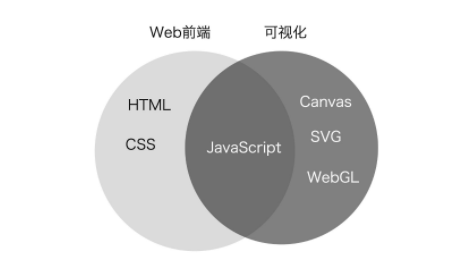

### 开篇词 | 不写网页的前端工程师，还能干什么？

可视化可不只是在绘制图表，图表只是可视化工程师日常工作产出的一部分。而就像上面这个例子一样，**可视化更重要的是利用 WebGL 这样的图形系统，来更高效地实现更多有趣的图形。**

#### 如何成为一名可视化工程师？

一名优秀的可视化工程师，最应当具备的能力就是要根据产品经理和设计师的想法，实现真正贴合用户需求的、灵活多变的、具有视觉震撼力，并且充满创意的优秀可视化作品。

因此，想要成为一名可视化工程师，**我们不能停留在可视化现有的库、框架和工具的使用层面上，必须深入技术栈的底层，充分理解数据，掌握视觉呈现相关的技术和基本原理。打好基础之后，再系统地学习可视化领域的方法论，才能提高解决问题的能力。**

#### 如何快速掌握可视化？

一张知识结构图：

重点学习以下知识：

1. 首先，可视化的视觉主要涉及四个部分，分别是理论基础、图形系统、图形库和工具。看起来内容很多，但我们没有必要全都深入学习。而是应该把重点放在理论基础上，因为随着技术的发展，工具会改变，而基础不会。视觉部分的理论基础就是数学和图形学，也就是说，我们必须要学会如何运用数学和图形学知识，来绘制各种各样的几何图形，这样才能实现更加酷炫的视觉效果。

2. 在性能方面，我们应该学习的，是如何快速找到合理的性能优化点。

3. 可视化学习路径图：

   

#### 课程设计

1. **第一部分，图形基础。**首先，我会带你熟悉 HTML/CSS、SVG、Canvas2D 和 WebGL 这四种图形系统，并会结合一些简单的实际案例，帮助你全面掌握它们的基本用法、原则、优点和局限性。通过这部分的内容，你能对图形系统有一个大体的认知，并且掌握一些必须的绘图技巧，从而能够更好地学习后续的课程。
2. **第二部分，数学基础。**在这一部分里，我希望通过对向量和矩阵运算、参数方程、三角剖分和仿射变换等内容的深入讲解以及综合运用，来帮助你建立一套通用的数学知识体系，能适用于所有图形系统，以此来解决可视化图形呈现中的大部分问题。
3. **第三部分，视觉呈现。**视觉呈现效果是衡量可视化效果的重要指标，因此，实现各种视觉效果的能力，可以说是可视化工程师的核心竞争力。视觉呈现也是可视化中非常重要的内容，那这一部分我会分两个阶段来讲：在基础阶段，我们主要讨论如何以像素化的方式处理图案，来实现各种细节效果；在高级阶段，我们讨论动画、3D 和交互等更深入的话题。并且，我还会借助美颜、图片处理和视觉特效等实际例子，来教你怎样更好地应用数学和图形学知识，帮你全面提升视觉呈现的能力。
4. **第四部分，性能优化。**这一部分，我会讲解 WebGL 渲染复杂的 2D、3D 模型的方法，让你了解可视化高性能渲染的技术思路，比较轻松地找到可视化应用中的性能瓶颈并着手优化。再结合我总结出的一些成熟的方法论，你就能在实现可视化项目的时候，解决大规模数据批量渲染的性能瓶颈问题，来实现更酷炫的视觉效果了。
5. **最后一部分，我们将重点讨论数据驱动。**通常来说，数据的格式和量级决定了图形系统的选择和渲染方式。一个成熟的可视化系统，应该包括数据引擎和渲染引擎两部分。所以，对于可视化而言，数据和渲染同样重要。那么在这一部分中，我会结合 3D 柱状图、3D 层级结构图、3D 音乐可视化等案例，讲解数据处理的技巧，真正将数据和视觉呈现结合起来，实现具有科技感的 3D 可视化大屏效果，并最终形成完整的可视化解决方案。

### 预习 | Web前端与可视化到底有什么区别？

**可视化是将数据组织成易于为人所理解和认知的结构，然后用图形的方式形象地呈现出来的理论、方法和技术。**实现可视化有两个关键要素，一个是数据，另一个是图形。如果要考虑在计算机上呈现，那还要加上交互。

#### Web 前端与可视化有什么区别？

​	从工作内容来看，前端工程师主要负责处理内容呈现和用户交互。可视化的数据呈现，尤其是在 Web 端的呈现，也属于前端工程师的范畴。但是，与传统的前端开发相比，可视化开发的工具、思路和方法，又和 Web 有着比较大的区别。

​	**首先是技术栈的不同**。Web 开发主要以 HTML 来描述结构，以 CSS 来描述表现，以 JavaScript 来描述行为。而可视化则较少涉及 HTML 和 CSS，它更多地要同浏览器的 Canvas、SVG、WebGL 等其他图形 API 打交道。这是因为，Web 开发以呈现块状内容为主，所以 HTML 是更合适的技术。而可视化开发因为需要呈现各种各样的形状、结构，所以，形状更丰富的 SVG 以及更底层的 Canvas2D 和 WebGL 就是更合适的技术了。

​	**其次，Web 开发着重于处理普通的文本和多媒体信息，渲染普通的、易于阅读的文本和多媒体内容，而可视化开发则着重于处理结构化数据，渲染各种相对复杂的图表和图形元素。**两者针对的信息特征和对图形渲染的要求有所不同，所以，在**细节处理**上也有比较大的差异。

​	简而言之，就是 Web 开发的前端主要还是关注内容和样式，图形的渲染和绘制是由浏览器底层来完成的，而可视化前端则可能要深入底层渲染层，去真正地控制图形的绘制和细节的呈现。

#### 可视化领域的工具

1. 可视化应用通常需要绘制大量的**图表**，比如，柱状图、折线图、饼图，还有一些简单的平面地图等等。图表库能够帮助我们快速把它们绘制出来。**ECharts、Chartist、Chart.js**等等。
2. 如果要绘制更加复杂的地图，比如，一座城市的交通线路和建筑物三维模型，或者一个园区的立体建筑模型等等，我们可能要依赖专业的 **GIS 地图库**。**Mapbox、Leaflet、Deck.gl、CesiumJS**等等。
3. 如果要绘制其他更灵活的图形、图像或者物理模型，我们常用的一些图表库就不一定能完成了。这个时候，我们可以用**ThreeJS、SpriteJS**这样比较**通用的渲染库**（实际上图表库或 GIS 地图库本身底层渲染也基于这些渲染库）。我们可以选择通用的图形库，比如，2D 渲染可以选择 SpriteJS，3D 渲染可以选择 ThreeJS、BabylonJS 以及 SpriteJS3D 扩展等等。
4. **专注于处理数据的组织形式**，而将数据呈现交给更底层的图形系统（DOM、SVG、Canvas）或通用图形库（SpriteJS、ThreeJS）去完成。如D3.js。D3.js 因为只关注数据的组织形式，将具体的渲染交给底层去做，所以更加灵活，扩展起来也很方便。但相对地，就不像其他的图表库一样，拥有完整的封装了，使用的门槛也就相对高一些。

#### 总结：

​	Web前端和可视化的区别：

1. 首先是技术栈的不同。Web 开发主要会用到 HTML 和 CSS，而可视化则较少涉及 HTML 和 CSS，它更多地要同浏览器的 Canvas、SVG、WebGL 等其他图形 API 打交道。
2. 其次，Web 开发着重于处理普通的文本和多媒体信息，渲染普通的、易于阅读的文本和多媒体内容，而可视化开发则着重于处理结构化数据，有时需要深入渲染引擎层，从而控制细节，让浏览器渲染出各种相对复杂的图表和图形元素。

